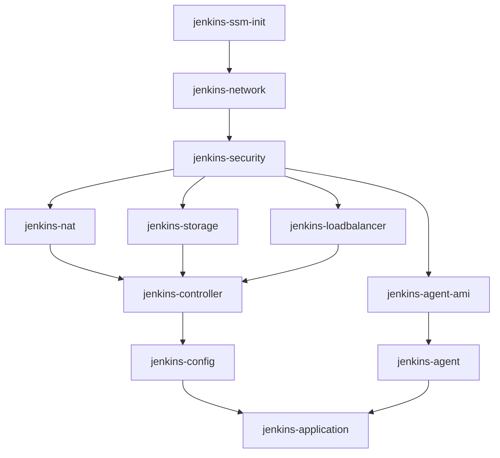
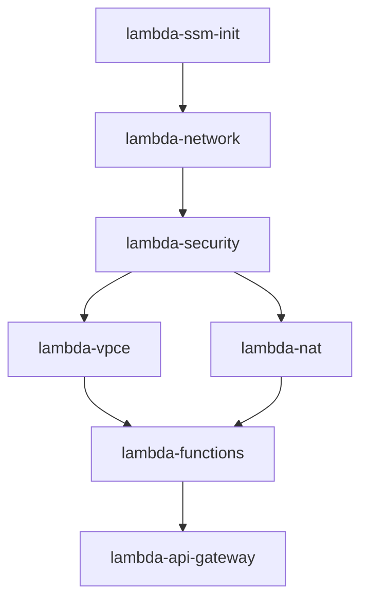

# Ansible自動化プレイブック

AWS上にインフラストラクチャを自動構築・管理するためのAnsibleプレイブック集です。

## 📋 目次

- [概要](#概要)
- [前提条件](#前提条件)
- [ディレクトリ構造](#ディレクトリ構造)
- [クイックスタート](#クイックスタート)
- [システム別プレイブック](#システム別プレイブック)
- [ロール一覧](#ロール一覧)
- [使用方法](#使用方法)
- [環境変数](#環境変数)
- [トラブルシューティング](#トラブルシューティング)

## 概要

このAnsibleプロジェクトは、様々なシステムの完全自動化を実現します：

### 現在サポートしているシステム

#### Jenkins CI/CD
- **インフラストラクチャ管理**: Pulumiと連携したIaCの実行
- **Jenkins環境構築**: Controller/Agent構成の自動セットアップ
- **セキュリティ管理**: IAMロール、セキュリティグループの自動設定
- **高可用性対応**: ALB、Auto Scaling、EFSによるHA構成

#### Lambda Functions
- **サーバーレス環境**: Lambda関数の自動デプロイ
- **API Gateway連携**: REST APIの構築
- **VPCネットワーク**: プライベートサブネットでのLambda実行
- **NATインスタンス**: 外部通信用のNATゲートウェイ

### 共通機能
- **Infrastructure as Code**: Pulumiによる宣言的なインフラ管理
- **パラメータ管理**: SSM Parameter Storeによる設定の一元管理
- **マルチ環境対応**: dev/staging/production環境の分離管理

## 前提条件

### 必要なソフトウェア

- Ansible 2.9以上
- Python 3.8以上
- AWS CLI v2
- Node.js 18以上（Pulumi実行用）
- Pulumi CLI 3.0以上

### AWS権限

実行するIAMユーザー/ロールには以下の権限が必要です：

- EC2フルアクセス
- VPCフルアクセス
- IAM（ロール作成・管理）
- S3（Pulumiステート管理）
- Systems Manager（パラメータストア、Session Manager）
- CloudFormation（Bootstrap環境用）
- Lambda（サーバーレス機能用）

### 環境セットアップ

```bash
# Python仮想環境の作成（推奨）
python3 -m venv venv
source venv/bin/activate  # Windows: venv\Scripts\activate

# 必要なPythonパッケージのインストール
pip install ansible boto3 botocore

# AWS認証情報の設定
aws configure
```

## ディレクトリ構造

```
ansible/
├── ansible.cfg              # Ansible設定ファイル
├── inventory/               # インベントリ設定
│   ├── hosts               # ホスト定義
│   └── group_vars/         # グループ変数
│       └── all.yml         # 全体共通変数
├── playbooks/              # プレイブック
│   ├── jenkins/            # Jenkins関連
│   │   ├── deploy/         # デプロイ用
│   │   ├── remove/         # 削除用
│   │   └── misc/           # その他ユーティリティ
│   ├── test/               # テスト用プレイブック
│   └── lambda_*.yml        # Lambda関連
└── roles/                  # Ansibleロール
    ├── jenkins_*/          # Jenkinsコンポーネント
    ├── lambda_*/           # Lambdaコンポーネント
    └── *_helper/           # ヘルパーユーティリティ
```

## クイックスタート

### システム別の基本操作

#### Jenkins CI/CD

```bash
# 完全デプロイ
cd ansible
ansible-playbook playbooks/jenkins/jenkins_setup_pipeline.yml -e "env=dev"

# 完全削除
ansible-playbook playbooks/jenkins/jenkins_teardown_pipeline.yml -e "env=dev confirm=true"

# 個別コンポーネントデプロイ例
ansible-playbook playbooks/jenkins/deploy/deploy_jenkins_network.yml -e "env=dev"
```

#### Lambda Functions

```bash
# 完全デプロイ
cd ansible
ansible-playbook playbooks/lambda_setup_pipeline.yml -e "env=dev"

# 完全削除
# 【重要】Jenkinsから実行する場合、force_destroy=true の明示的な設定が必須です
ansible-playbook playbooks/lambda/lambda_teardown_pipeline.yml -e "env=dev force_destroy=true"

# SSMパラメータも削除する場合
ansible-playbook playbooks/lambda/lambda_teardown_pipeline.yml -e "env=dev force_destroy=true destroy_ssm=true"
```

**注意**: 非対話モード（CI/Jenkins）では`force_destroy=true`が必須パラメータです。設定されていない場合、安全のため処理が停止します。

**セーフガード機能**: プレイブック（66-69行目）で実装されており、誤操作による本番環境の削除を防止します。

## システム別プレイブック

### Jenkins CI/CDシステム

#### パイプラインプレイブック

| プレイブック | 説明 | 実行例 |
|------------|------|--------|
| `jenkins_setup_pipeline.yml` | Jenkins環境の完全セットアップ | `ansible-playbook playbooks/jenkins/jenkins_setup_pipeline.yml -e "env=dev"` |
| `jenkins_teardown_pipeline.yml` | Jenkins環境の完全削除 | `ansible-playbook playbooks/jenkins/jenkins_teardown_pipeline.yml -e "env=dev confirm=true"` |

#### デプロイプレイブック

| プレイブック | 説明 | 依存関係 |
|------------|------|----------|
| `deploy_jenkins_ssm_init.yml` | SSMパラメータ初期化 | なし |
| `deploy_jenkins_network.yml` | VPC、サブネット構築 | ssm_init |
| `deploy_jenkins_security.yml` | セキュリティグループ、IAMロール | network |
| `deploy_jenkins_nat.yml` | NATゲートウェイ設定 | security |
| `deploy_jenkins_storage.yml` | EFSストレージ構築 | security |
| `deploy_jenkins_loadbalancer.yml` | ALB構築 | security |
| `deploy_jenkins_agent_ami.yml` | エージェント用AMI作成 | security |
| `deploy_jenkins_controller.yml` | Jenkinsコントローラー構築 | nat, storage, loadbalancer |
| `deploy_jenkins_agent.yml` | Jenkinsエージェント構築 | agent_ami, controller |
| `deploy_jenkins_config.yml` | Jenkins初期設定 | controller |
| `deploy_jenkins_application.yml` | Jenkinsアプリケーション設定 | config, agent |

#### メンテナンスプレイブック

| プレイブック | 説明 | パラメータ |
|------------|------|----------|
| `cleanup_image_builder_amis.yml` | Image BuilderのAMIを世代管理 | `retention_count`: 保持世代数<br>`dry_run`: 実行モード |
| `update_jenkins_ami_ssm.yml` | Jenkins AMI SSMパラメータ更新 | なし |

### Lambdaシステム

#### パイプラインプレイブック

| プレイブック | 説明 | 実行例 |
|------------|------|--------|
| `lambda_setup_pipeline.yml` | Lambda環境の完全セットアップ | `ansible-playbook playbooks/lambda_setup_pipeline.yml -e "env=dev"` |
| `lambda_teardown_pipeline.yml` | Lambda環境の削除 | `ansible-playbook playbooks/lambda_teardown_pipeline.yml -e "env=dev force_destroy=true"` |

#### 個別コンポーネント

| プレイブック | 説明 | 依存関係 |
|------------|------|----------|
| `lambda/lambda_ssm_init.yml` | SSMパラメータ初期化 | なし |
| `lambda/lambda_network.yml` | VPC、サブネット構築 | ssm_init |
| `lambda/lambda_security.yml` | セキュリティグループ設定 | network |
| `lambda/lambda_vpce.yml` | VPCエンドポイント構築 | security |
| `lambda/lambda_nat.yml` | NATインスタンス構築 | security |
| `lambda/lambda_functions.yml` | Lambda関数デプロイ | nat, vpce |
| `lambda/lambda_api_gateway.yml` | API Gateway構築 | functions |


### テストプレイブック

| プレイブック | 説明 | 実行例 |
|------------|------|--------|
| `test-aws-cli-helper.yml` | AWS CLIヘルパーのテスト | `ansible-playbook playbooks/test/test-aws-cli-helper.yml` |
| `test-s3-validation.yml` | S3バケット検証 | `ansible-playbook playbooks/test/test-s3-validation.yml` |
| `test-ssm-parameter-store.yml` | SSMパラメータストアのテスト | `ansible-playbook playbooks/test/test-ssm-parameter-store.yml` |
| `test-cloudwatch-agent.yml` | CloudWatch Agent動作検証 | `ansible-playbook playbooks/test/test-cloudwatch-agent.yml -e "env=dev"` |


## Docker Image Pre-pulling

### 概要

Jenkins Agentでは、頻繁に使用されるDockerイメージをAMIビルド時に事前にプルしてキャッシュします。これにより、ジョブ実行時のイメージダウンロード時間を劇的に短縮し、パイプライン全体の高速化と安定性向上を実現します。

### 事前プルされるDockerイメージ一覧（8種類）

| イメージ | タグ | サイズ（概算） | 使用箇所 |
|---------|------|--------------|----------|
| python | 3.11-slim | 130MB | diagram-generator, pull-request-comment-builder |
| node | 18-slim | 180MB | mermaid-generator |
| rust | 1.76-slim | 850MB | pr-complexity-analyzer |
| rust | slim | 850MB | (バックアップ用) |
| amazon/aws-cli | latest | 400MB | ssm-dashboard, pulumi-dashboard |
| pulumi/pulumi | latest | 100MB | pulumi-dashboard |
| ubuntu | 22.04 | 77MB | (汎用用途) |
| nikolaik/python-nodejs | python3.11-nodejs20 | 400MB | auto-insert-doxygen-comment, technical-docs-writer |

**合計サイズ**: 約2.9GB

### 効果

- **ジョブ起動時間短縮**: 小イメージで10-20秒→1-2秒、大イメージで1-2分→1-2秒
- **ネットワーク帯域削減**: ジョブ実行時のダウンロードがほぼゼロ
- **レート制限回避**: Docker Hubのレート制限を回避し、大規模並列実行時も安定動作
- **オフライン動作**: ネットワーク障害時もキャッシュされたイメージで継続動作可能

### AMIへの影響

- **AMIサイズ増加**: 約2-3GB
- **AMIビルド時間**: 30-45分 → 35-50分（+5-10分程度）
- **EBSストレージコスト**: 約$0.24/月増加（開発環境のみならほぼ無視できる）

### 実装方法

Dockerイメージの事前プルは、EC2 Image Builderのコンポーネント定義（`pulumi/jenkins-agent-ami/component-arm.yml`と`pulumi/jenkins-agent-ami/component-x86.yml`）で実装されています。EnableCloudWatchAgentステップの直後に`PullDockerImages`ステップが追加され、AMIビルド時に自動的にイメージがプルされます。

## CloudWatchモニタリング

### 概要

Jenkins Agentのメモリ使用状況をCloudWatchで監視できます。CloudWatch Agentを使用してメトリクスを収集し、CloudWatchコンソールで可視化します。

### 収集メトリクス

| メトリクス名 | 説明 | 単位 |
|------------|------|------|
| `mem_used_percent` | メモリ使用率 | パーセント |
| `mem_used` | メモリ使用量 | バイト |
| `mem_available` | メモリ空き容量 | バイト |

### メトリクス設定

- **Namespace**: `CWAgent`
- **Dimension**: `AutoScalingGroupName` のみ
- **送信間隔**: 60秒
- **コスト**: 約$0.60-1.0/月（固定、インスタンス台数に依存しない）

### CloudWatchコンソールでの確認手順

1. AWSコンソールでCloudWatchサービスを開く
2. 左メニューから「メトリクス」→「すべてのメトリクス」を選択
3. 「CWAgent」Namespaceを選択
4. 「AutoScalingGroupName」Dimensionを選択
5. Jenkins AgentのAutoScalingGroup名を選択
6. メトリクス（`mem_used_percent`, `mem_used`, `mem_available`）を選択してグラフ表示

### トラブルシューティング

#### メトリクスが表示されない場合

1. **CloudWatch Agentサービスの確認**:
   ```bash
   # SSM Session Managerでインスタンスに接続
   systemctl status amazon-cloudwatch-agent
   ```
   - サービスが起動していない場合: `systemctl start amazon-cloudwatch-agent`
   - サービスが有効化されていない場合: `systemctl enable amazon-cloudwatch-agent`

2. **設定ファイルの確認**:
   ```bash
   cat /opt/aws/amazon-cloudwatch-agent/etc/amazon-cloudwatch-agent.json
   ```
   - 設定ファイルが存在しない場合: AMIが古い可能性があります。最新のAMIを使用してください。

3. **IAM権限の確認**:
   - Jenkins Agent IAMロールに `CloudWatchAgentServerPolicy` がアタッチされているか確認

4. **ログの確認**:
   ```bash
   journalctl -u amazon-cloudwatch-agent -n 100
   ```

#### コストが予想より高い場合

- CloudWatchコンソールで実際のメトリクス数を確認
- Dimensionに `InstanceId` が含まれていないか確認（含まれている場合は設定ミス）
- 期待されるメトリクス数: 3個（`mem_used_percent`, `mem_used`, `mem_available`）

### テスト方法

CloudWatch Agent動作確認テストプレイブックを実行:
```bash
cd ansible
ansible-playbook playbooks/test/test-cloudwatch-agent.yml -e "env=dev"
```

このテストは以下を検証します:
- CloudWatch Agentサービスの起動状態
- 設定ファイルの存在
- メトリクスがCloudWatchに送信されているか
- Dimension設定の正確性（`AutoScalingGroupName` のみ）


## ロール一覧

### システム別ロール

#### Jenkinsコンポーネント

| ロール | 説明 | 主なタスク |
|--------|------|------------|
| `jenkins_ssm_init` | SSMパラメータの初期設定 | deploy, destroy |
| `jenkins_network` | ネットワーク基盤構築 | deploy, destroy |
| `jenkins_security` | セキュリティ設定 | deploy, destroy |
| `jenkins_nat` | NATゲートウェイ管理 | deploy, destroy |
| `jenkins_storage` | EFSストレージ管理 | deploy, destroy |
| `jenkins_loadbalancer` | ALB管理 | deploy, destroy |
| `jenkins_controller` | Jenkinsコントローラー管理 | deploy, destroy |
| `jenkins_agent_ami` | エージェントAMI管理 | deploy, destroy, cleanup_amis |
| `jenkins_cleanup_agent_amis` | Jenkins Agent AMIクリーンアップ | 世代管理によるAMI/スナップショット削除 |
| `jenkins_agent` | Jenkinsエージェント管理 | deploy, destroy |
| `jenkins_config` | Jenkins設定管理 | setup, destroy |
| `jenkins_application` | Jenkinsアプリケーション管理 | deploy, destroy |

#### Lambdaコンポーネント

| ロール | 説明 | 主なタスク |
|--------|------|------------|
| `lambda_account_setup` | Lambdaアカウント初期設定 | deploy, destroy |
| `lambda_network` | Lambda用VPC構築 | deploy, destroy |
| `lambda_security` | Lambda用セキュリティ設定 | deploy, destroy |
| `lambda_nat` | Lambda用NAT管理 | deploy, destroy |
| `lambda_functions` | Lambda関数デプロイ | deploy, destroy |
| `lambda_api_gateway` | API Gateway設定 | deploy, destroy |
| `lambda_vpce` | VPCエンドポイント管理 | deploy, destroy |
| `lambda_ssm_init` | SSMパラメータ初期化 | deploy, destroy |

### 共通ヘルパーロール

| ロール | 説明 | 主な機能 |
|--------|------|----------|
| `pulumi_helper` | Pulumiスタック管理 | deploy, destroy, preview, refresh |
| `ssm_parameter_store` | SSMパラメータ管理 | get, set, delete, validate |
| `aws_cli_helper` | AWS CLI実行補助 | execute, retry, parse_json |
| `aws_setup` | AWS基本設定 | 認証情報確認 |

## 使用方法

### 基本的な実行方法

```bash
# 基本実行
ansible-playbook playbooks/jenkins/deploy/deploy_jenkins_network.yml -e "env=dev"

# デバッグモード
ansible-playbook playbooks/jenkins/deploy/deploy_jenkins_network.yml -e "env=dev" -vvv

# チェックモード（ドライラン）
ansible-playbook playbooks/jenkins/deploy/deploy_jenkins_network.yml -e "env=dev" --check

# 特定のタグのみ実行
ansible-playbook playbooks/jenkins/deploy/deploy_jenkins_network.yml -e "env=dev" --tags "deploy"

# 特定のタスクをスキップ
ansible-playbook playbooks/jenkins/deploy/deploy_jenkins_network.yml -e "env=dev" --skip-tags "cleanup"
```

### 環境別実行

```bash
# 開発環境
ansible-playbook playbooks/jenkins/jenkins_setup_pipeline.yml -e "env=dev"

# ステージング環境
ansible-playbook playbooks/jenkins/jenkins_setup_pipeline.yml -e "env=staging"

# 本番環境
ansible-playbook playbooks/jenkins/jenkins_setup_pipeline.yml -e "env=prod"
```

### システム固有の操作

#### Jenkins固有操作

```bash
# AMIパラメータ更新
ansible-playbook playbooks/jenkins/misc/update_jenkins_ami_ssm.yml -e "env=dev"

# Image Builder AMIのクリーンアップ（ドライラン）
ansible-playbook playbooks/jenkins/maintenance/cleanup_image_builder_amis.yml -e "env=dev"

# Image Builder AMIのクリーンアップ（実行）
ansible-playbook playbooks/jenkins/maintenance/cleanup_image_builder_amis.yml -e "env=dev dry_run=false"

# 保持世代数を指定してクリーンアップ
ansible-playbook playbooks/jenkins/maintenance/cleanup_image_builder_amis.yml -e "env=dev retention_count=3 dry_run=false"
```

#### Lambda固有操作

```bash
# 個別コンポーネントのデプロイ
ansible-playbook playbooks/lambda/lambda_network.yml -e "env=dev"
ansible-playbook playbooks/lambda/lambda_functions.yml -e "env=dev"
ansible-playbook playbooks/lambda/lambda_api_gateway.yml -e "env=dev"
```

## 環境変数

### 必須環境変数

| 変数名 | 説明 | デフォルト値 |
|--------|------|-------------|
| `AWS_REGION` | AWSリージョン | ap-northeast-1 |
| `PULUMI_CONFIG_PASSPHRASE` | Pulumi暗号化パスフレーズ | なし（必須） |

### オプション環境変数

| 変数名 | 説明 | デフォルト値 |
|--------|------|-------------|
| `JENKINS_VERSION` | Jenkinsバージョン | 2.426.1 |
| `DEPLOY_ENV` | デプロイ環境 | dev |
| `ANSIBLE_VAULT_PASSWORD_FILE` | Vault パスワードファイル | なし |

### 環境変数の設定例

```bash
# .envファイルを作成
cat > .env << EOF
export AWS_REGION=ap-northeast-1
export PULUMI_CONFIG_PASSPHRASE=your-secure-passphrase
export JENKINS_VERSION=2.426.1
export DEPLOY_ENV=dev
EOF

# 環境変数を読み込み
source .env
```

## 実行時パラメータ

### 共通パラメータ

| パラメータ | 説明 | 必須 | デフォルト |
|-----------|------|------|------------|
| `env` | 環境名（dev/staging/prod） | Yes | なし |
| `aws_region` | AWSリージョン | No | ap-northeast-1 |
| `project_name` | プロジェクト名 | No | jenkins-infra |

### システム固有パラメータ

#### Jenkins

| パラメータ | 説明 | デフォルト |
|-----------|------|------------|
| `jenkins_version` | Jenkinsバージョン | 2.426.1 |
| `jenkins_admin_user` | 管理者ユーザー名 | admin |
| `instance_type` | EC2インスタンスタイプ | t3.medium |
| `volume_size` | EBSボリュームサイズ(GB) | 100 |

#### Lambda

| パラメータ | 説明 | デフォルト |
|-----------|------|------------|
| `lambda_runtime` | Lambda実行環境 | python3.9 |
| `lambda_timeout` | タイムアウト(秒) | 30 |
| `api_gateway_type` | API Gatewayタイプ | REST |

### 削除時パラメータ

| パラメータ | 説明 | 必須 | デフォルト |
|-----------|------|------|------------|
| `confirm` | 削除の確認 | Yes | false |
| `force_delete` | 強制削除 | No | false |


## デプロイメントアーキテクチャ

### コンポーネント依存関係

各システムのコンポーネントには依存関係があり、正しい順序でデプロイ・削除する必要があります。

#### Jenkins CI/CD依存関係図



#### Lambda API依存関係図



#### デプロイ順序（Jenkins）

1. **初期化**: jenkins-ssm-init（パラメータ準備）
2. **基盤**: jenkins-network → jenkins-security
3. **ネットワーク**: jenkins-nat
4. **ストレージ**: jenkins-storage
5. **ロードバランサー**: jenkins-loadbalancer
6. **コンピュート**: jenkins-controller → jenkins-agent-ami → jenkins-agent
7. **アプリケーション**: jenkins-config → jenkins-application

#### デプロイ順序（Lambda）

1. **初期化**: lambda-ssm-init（パラメータ準備）
2. **基盤**: lambda-network → lambda-security
3. **ネットワーク**: lambda-vpce、lambda-nat
4. **コンピュート**: lambda-functions
5. **API**: lambda-api-gateway

#### 削除順序（Jenkins）

削除はデプロイの逆順で実行します：

1. jenkins-application
2. jenkins-config
3. jenkins-agent
4. jenkins-agent-ami
5. jenkins-controller
6. jenkins-loadbalancer
7. jenkins-storage
8. jenkins-nat
9. jenkins-security
10. jenkins-network
11. jenkins-ssm-init

#### 削除順序（Lambda）

削除はデプロイの逆順で実行します：

1. lambda-api-gateway
2. lambda-functions
3. lambda-nat
4. lambda-vpce
5. lambda-security
6. lambda-network
7. lambda-ssm-init（オプション）

## クイックスタート

### 最初に試す：AWS接続テスト

```bash
# AWS CLIヘルパーのテスト
cd ansible
ansible-playbook playbooks/test/test-aws-cli-helper.yml

# SSMパラメータストアのテスト
ansible-playbook playbooks/test/test-ssm-parameter-store.yml
```

### Jenkins環境の構築

```bash
# 完全デプロイ（約20-30分）
ansible-playbook playbooks/jenkins/jenkins_setup_pipeline.yml -e "env=dev"

# ステータス確認
ansible-playbook playbooks/jenkins/misc/jenkins_status_check.yml -e "env=dev"
```

## トラブルシューティング

### よくある問題と解決方法

#### 1. Pulumi認証エラー

```bash
# エラー: error: getting secrets manager: passphrase must be set
# 解決方法:
export PULUMI_CONFIG_PASSPHRASE=your-passphrase
```

#### 2. AWS認証エラー

```bash
# エラー: Unable to locate credentials
# 解決方法:
aws configure
# または
export AWS_PROFILE=your-profile
```

#### 3. Ansibleモジュールが見つからない

```bash
# エラー: boto3 required for this module
# 解決方法:
pip install boto3 botocore
```

#### 4. Pulumiスタックが存在しない

```bash
# エラー: error: no stack named 'dev' found
# 解決方法:
cd pulumi/jenkins-network
pulumi stack init dev
```

#### 5. Image Builder AMIクリーンアップエラー

```bash
# エラー: AMI is currently in use
# 解決方法: 使用中のAMIはスキップされます。EC2インスタンスを停止してから再実行

# エラー: retention_count is too low
# 解決方法: 最小保持数（デフォルト1）以上を指定
ansible-playbook playbooks/jenkins/maintenance/cleanup_image_builder_amis.yml -e "env=dev retention_count=2"
```

#### 6. SSMパラメータエラー

```bash
# エラー: SSM parameter not found
# 解決方法: SSM初期化から実行
ansible-playbook playbooks/jenkins/deploy/deploy_jenkins_ssm_init.yml -e "env=dev"
```

#### 5. リソースの依存関係エラー

```bash
# エラー: Resource dependency not found
# 解決方法: 正しい順序でデプロイ
ansible-playbook playbooks/jenkins/jenkins_setup_pipeline.yml -e "env=dev"
```

### デバッグ方法

```bash
# 詳細ログを表示
ansible-playbook playbook.yml -vvv

# 変数の確認
ansible-playbook playbook.yml -e "env=dev" --tags "debug"

# タスクのステップ実行
ansible-playbook playbook.yml --step

# 特定のホストのみ実行
ansible-playbook playbook.yml --limit localhost
```

### ログファイルの確認

```bash
# Ansible実行ログ
tail -f /var/log/ansible.log

# Pulumi実行ログ
pulumi logs --follow

# Jenkins Controller ログ（EC2インスタンス上）
sudo tail -f /var/log/jenkins/jenkins.log
```

## セキュリティ

### 機密情報の管理

```bash
# Ansible Vaultで暗号化
ansible-vault encrypt inventory/group_vars/prod.yml

# 実行時に復号化
ansible-playbook playbook.yml --ask-vault-pass
```

### 推奨事項

- SSMパラメータストアで機密情報を管理
- IAMロールベースの認証を使用
- 本番環境では最小権限の原則を適用

## 開発者向け情報

プレイブックやロールの開発方法については[CONTRIBUTION.md](CONTRIBUTION.md)を参照してください。


## 関連ドキュメント

### プロジェクトドキュメント
- [メインREADME](../README.md) - プロジェクト全体の概要とクイックナビゲーション
- [CONTRIBUTION.md](CONTRIBUTION.md) - Ansibleプレイブック開発規約
- [Pulumi README](../pulumi/README.md) - Pulumiスタックの詳細
- [Bootstrap README](../bootstrap/README.md) - Bootstrap環境の構築手順

### 外部リソース
- [Ansible公式ドキュメント](https://docs.ansible.com/)
- [AWS公式ドキュメント](https://docs.aws.amazon.com/)

## サポート

問題が発生した場合は、以下を確認してください：

1. このREADMEのトラブルシューティングセクション
2. [メインREADME](../README.md)とdocs/配下の詳細ドキュメント
3. 各ロールのREADME（`roles/*/README.md`）
4. Ansibleの公式ドキュメント

## ライセンス

このプロジェクトは内部利用を目的としています。詳細は[LICENSE](../LICENSE)を参照してください。