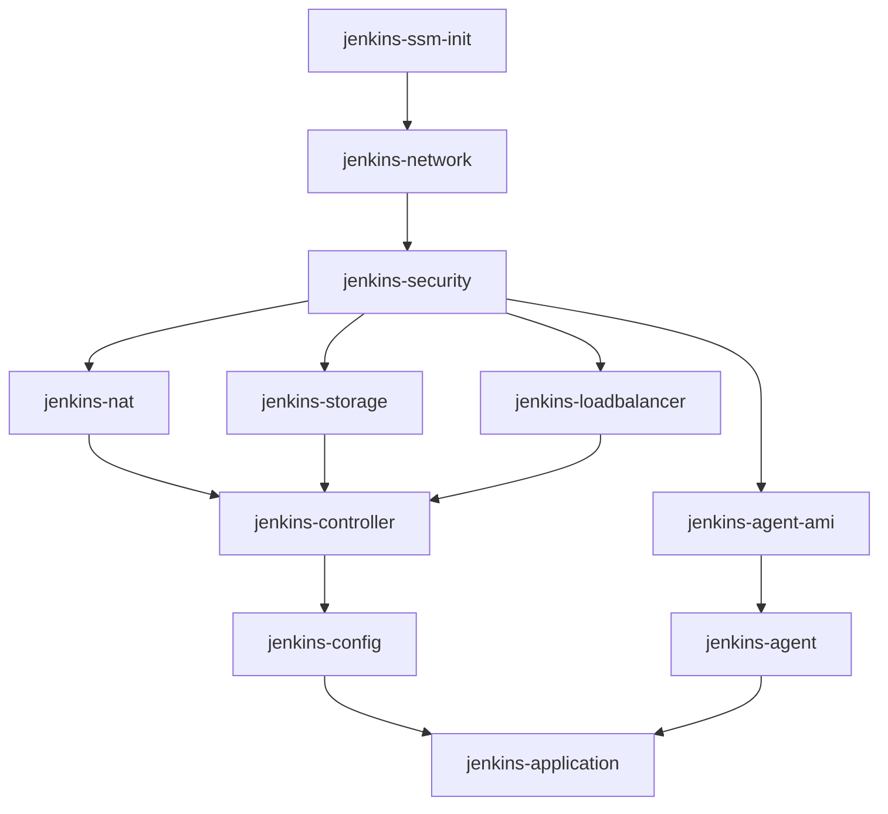

# Ansible自動化プレイブック

AWS上にインフラストラクチャを自動構築・管理するためのAnsibleプレイブック集です。

## 📋 目次

- [概要](#概要)
- [前提条件](#前提条件)
- [ディレクトリ構造](#ディレクトリ構造)
- [クイックスタート](#クイックスタート)
- [システム別プレイブック](#システム別プレイブック)
- [ロール一覧](#ロール一覧)
- [使用方法](#使用方法)
- [環境変数](#環境変数)
- [トラブルシューティング](#トラブルシューティング)

## 概要

このAnsibleプロジェクトは、様々なシステムの完全自動化を実現します：

### 現在サポートしているシステム

#### Jenkins CI/CD
- **インフラストラクチャ管理**: Pulumiと連携したIaCの実行
- **Jenkins環境構築**: Controller/Agent構成の自動セットアップ
- **セキュリティ管理**: IAMロール、セキュリティグループの自動設定
- **高可用性対応**: ALB、Auto Scaling、EFSによるHA構成

#### Lambda Functions
- **サーバーレス環境**: Lambda関数の自動デプロイ
- **API Gateway連携**: REST API、WebSocket APIの構築
- **IPホワイトリスト管理**: WAFとの連携によるアクセス制御

### 共通機能
- **Infrastructure as Code**: Pulumiによる宣言的なインフラ管理
- **パラメータ管理**: SSM Parameter Storeによる設定の一元管理
- **マルチ環境対応**: dev/staging/production環境の分離管理

## 前提条件

### 必要なソフトウェア

- Ansible 2.9以上
- Python 3.8以上
- AWS CLI v2
- Node.js 18以上（Pulumi実行用）
- Pulumi CLI 3.0以上

### AWS権限

実行するIAMユーザー/ロールには以下の権限が必要です：

- EC2フルアクセス
- VPCフルアクセス
- IAM（ロール作成・管理）
- S3（Pulumiステート管理）
- Systems Manager（パラメータストア、Session Manager）
- CloudFormation（Bootstrap環境用）
- Lambda（サーバーレス機能用）

### 環境セットアップ

```bash
# Python仮想環境の作成（推奨）
python3 -m venv venv
source venv/bin/activate  # Windows: venv\Scripts\activate

# 必要なPythonパッケージのインストール
pip install ansible boto3 botocore

# AWS認証情報の設定
aws configure
```

## ディレクトリ構造

```
ansible/
├── ansible.cfg              # Ansible設定ファイル
├── inventory/               # インベントリ設定
│   ├── hosts               # ホスト定義
│   └── group_vars/         # グループ変数
│       └── all.yml         # 全体共通変数
├── playbooks/              # プレイブック
│   ├── jenkins/            # Jenkins関連
│   │   ├── deploy/         # デプロイ用
│   │   ├── remove/         # 削除用
│   │   └── misc/           # その他ユーティリティ
│   ├── test/               # テスト用プレイブック
│   └── lambda_*.yml        # Lambda関連
└── roles/                  # Ansibleロール
    ├── jenkins_*/          # Jenkinsコンポーネント
    ├── lambda_*/           # Lambdaコンポーネント
    └── *_helper/           # ヘルパーユーティリティ
```

## クイックスタート

### システム別の基本操作

#### Jenkins CI/CD

```bash
# 完全デプロイ
cd ansible
ansible-playbook playbooks/jenkins/jenkins_setup_pipeline.yml -e "env=dev"

# 完全削除
ansible-playbook playbooks/jenkins/jenkins_teardown_pipeline.yml -e "env=dev confirm=true"

# 個別コンポーネントデプロイ例
ansible-playbook playbooks/jenkins/deploy/deploy_jenkins_network.yml -e "env=dev"
```

#### Lambda Functions

```bash
# 完全デプロイ
cd ansible
ansible-playbook playbooks/lambda_setup_pipeline.yml -e "env=dev"

# 完全削除
ansible-playbook playbooks/lambda_teardown_pipeline.yml -e "env=dev confirm=true"

# IPホワイトリスト管理
ansible-playbook playbooks/lambda_ip_whitelist.yml -e "action=add ip_address=1.2.3.4"
```

## システム別プレイブック

### Jenkins CI/CDシステム

#### パイプラインプレイブック

| プレイブック | 説明 | 実行例 |
|------------|------|--------|
| `jenkins_setup_pipeline.yml` | Jenkins環境の完全セットアップ | `ansible-playbook playbooks/jenkins/jenkins_setup_pipeline.yml -e "env=dev"` |
| `jenkins_teardown_pipeline.yml` | Jenkins環境の完全削除 | `ansible-playbook playbooks/jenkins/jenkins_teardown_pipeline.yml -e "env=dev confirm=true"` |

#### デプロイプレイブック

| プレイブック | 説明 | 依存関係 |
|------------|------|----------|
| `deploy_jenkins_ssm_init.yml` | SSMパラメータ初期化 | なし |
| `deploy_jenkins_network.yml` | VPC、サブネット構築 | ssm_init |
| `deploy_jenkins_security.yml` | セキュリティグループ、IAMロール | network |
| `deploy_jenkins_nat.yml` | NATゲートウェイ設定 | security |
| `deploy_jenkins_storage.yml` | EFSストレージ構築 | security |
| `deploy_jenkins_loadbalancer.yml` | ALB構築 | security |
| `deploy_jenkins_agent_ami.yml` | エージェント用AMI作成 | security |
| `deploy_jenkins_controller.yml` | Jenkinsコントローラー構築 | nat, storage, loadbalancer |
| `deploy_jenkins_agent.yml` | Jenkinsエージェント構築 | agent_ami, controller |
| `deploy_jenkins_config.yml` | Jenkins初期設定 | controller |
| `deploy_jenkins_application.yml` | Jenkinsアプリケーション設定 | config, agent |

### Lambdaシステム

| プレイブック | 説明 | 実行例 |
|------------|------|--------|
| `lambda_setup_pipeline.yml` | Lambda環境の完全セットアップ | `ansible-playbook playbooks/lambda_setup_pipeline.yml -e "env=dev"` |
| `lambda_teardown_pipeline.yml` | Lambda環境の削除 | `ansible-playbook playbooks/lambda_teardown_pipeline.yml -e "env=dev confirm=true"` |
| `lambda_ip_whitelist.yml` | IPホワイトリスト管理 | `ansible-playbook playbooks/lambda_ip_whitelist.yml -e "action=add ip_address=1.2.3.4"` |

### テストプレイブック

| プレイブック | 説明 | 実行例 |
|------------|------|--------|
| `test-aws-cli-helper.yml` | AWS CLIヘルパーのテスト | `ansible-playbook playbooks/test/test-aws-cli-helper.yml` |
| `test-s3-validation.yml` | S3バケット検証 | `ansible-playbook playbooks/test/test-s3-validation.yml` |
| `test-ssm-parameter-store.yml` | SSMパラメータストアのテスト | `ansible-playbook playbooks/test/test-ssm-parameter-store.yml` |

#### テストプレイブックの記述規約

テストプレイブックを作成する際は、以下の形式でファイル先頭に実行例を記載してください：

```yaml
---
# ファイルの説明
#
# 実行例
# ======
#
# 基本実行:
#   ansible-playbook playbooks/test/test-example.yml
#
# パラメータ指定:
#   ansible-playbook playbooks/test/test-example.yml -e param=value
#
# デバッグモード:
#   ansible-playbook playbooks/test/test-example.yml -vvv
#
- name: テストプレイブック名
  hosts: localhost
  # ... 実装
```

## ロール一覧

### システム別ロール

#### Jenkinsコンポーネント

| ロール | 説明 | 主なタスク |
|--------|------|------------|
| `jenkins_ssm_init` | SSMパラメータの初期設定 | deploy, destroy |
| `jenkins_network` | ネットワーク基盤構築 | deploy, destroy |
| `jenkins_security` | セキュリティ設定 | deploy, destroy |
| `jenkins_nat` | NATゲートウェイ管理 | deploy, destroy |
| `jenkins_storage` | EFSストレージ管理 | deploy, destroy |
| `jenkins_loadbalancer` | ALB管理 | deploy, destroy |
| `jenkins_controller` | Jenkinsコントローラー管理 | deploy, destroy |
| `jenkins_agent_ami` | エージェントAMI管理 | deploy, destroy, cleanup_amis |
| `jenkins_agent` | Jenkinsエージェント管理 | deploy, destroy |
| `jenkins_config` | Jenkins設定管理 | setup, destroy |
| `jenkins_application` | Jenkinsアプリケーション管理 | deploy, destroy |

#### Lambdaコンポーネント

| ロール | 説明 | 主なタスク |
|--------|------|------------|
| `lambda_account_setup` | Lambdaアカウント初期設定 | deploy, destroy |
| `lambda_network` | Lambda用VPC構築 | deploy, destroy |
| `lambda_security` | Lambda用セキュリティ設定 | deploy, destroy |
| `lambda_nat` | Lambda用NAT管理 | deploy, destroy |
| `lambda_functions` | Lambda関数デプロイ | deploy, destroy |
| `lambda_api_gateway` | API Gateway設定 | deploy, destroy |
| `lambda_vpce` | VPCエンドポイント管理 | deploy, destroy |
| `lambda_waf` | WAF設定 | deploy, destroy |
| `lambda_websocket` | WebSocket API管理 | deploy |
| `lambda_ip_whitelist` | IPホワイトリスト操作 | add, list, init |

### 共通ヘルパーロール

| ロール | 説明 | 主な機能 |
|--------|------|----------|
| `pulumi_helper` | Pulumiスタック管理 | deploy, destroy, preview, refresh |
| `ssm_parameter_store` | SSMパラメータ管理 | get, set, delete, validate |
| `aws_cli_helper` | AWS CLI実行補助 | execute, retry, parse_json |
| `aws_setup` | AWS基本設定 | 認証情報確認 |

## 使用方法

### 基本的な実行方法

```bash
# 基本実行
ansible-playbook playbooks/jenkins/deploy/deploy_jenkins_network.yml -e "env=dev"

# デバッグモード
ansible-playbook playbooks/jenkins/deploy/deploy_jenkins_network.yml -e "env=dev" -vvv

# チェックモード（ドライラン）
ansible-playbook playbooks/jenkins/deploy/deploy_jenkins_network.yml -e "env=dev" --check

# 特定のタグのみ実行
ansible-playbook playbooks/jenkins/deploy/deploy_jenkins_network.yml -e "env=dev" --tags "deploy"

# 特定のタスクをスキップ
ansible-playbook playbooks/jenkins/deploy/deploy_jenkins_network.yml -e "env=dev" --skip-tags "cleanup"
```

### 環境別実行

```bash
# 開発環境
ansible-playbook playbooks/jenkins/jenkins_setup_pipeline.yml -e "env=dev"

# ステージング環境
ansible-playbook playbooks/jenkins/jenkins_setup_pipeline.yml -e "env=staging"

# 本番環境
ansible-playbook playbooks/jenkins/jenkins_setup_pipeline.yml -e "env=prod"
```

### システム固有の操作

#### Jenkins固有操作

```bash
# AMIパラメータ更新
ansible-playbook playbooks/jenkins/misc/update_jenkins_ami_ssm.yml -e "env=dev"
```

#### Lambda固有操作

```bash
# IPアドレスを追加
ansible-playbook playbooks/lambda_ip_whitelist.yml \
  -e "action=add ip_address=203.0.113.0 description='Office IP'"

# ホワイトリストを表示
ansible-playbook playbooks/lambda_ip_whitelist.yml -e "action=list"

# IPセットを初期化
ansible-playbook playbooks/lambda_ip_whitelist.yml -e "action=init"
```

## 環境変数

### 必須環境変数

| 変数名 | 説明 | デフォルト値 |
|--------|------|-------------|
| `AWS_REGION` | AWSリージョン | ap-northeast-1 |
| `PULUMI_CONFIG_PASSPHRASE` | Pulumi暗号化パスフレーズ | なし（必須） |

### オプション環境変数

| 変数名 | 説明 | デフォルト値 |
|--------|------|-------------|
| `JENKINS_VERSION` | Jenkinsバージョン | 2.426.1 |
| `PULUMI_STATE_BUCKET_NAME` | Pulumiステート用S3バケット | 自動検出 |
| `DEPLOY_ENV` | デプロイ環境 | dev |
| `ANSIBLE_VAULT_PASSWORD_FILE` | Vault パスワードファイル | なし |

### 環境変数の設定例

```bash
# .envファイルを作成
cat > .env << EOF
export AWS_REGION=ap-northeast-1
export PULUMI_CONFIG_PASSPHRASE=your-secure-passphrase
export JENKINS_VERSION=2.426.1
export DEPLOY_ENV=dev
EOF

# 環境変数を読み込み
source .env
```

## 実行時パラメータ

### 共通パラメータ

| パラメータ | 説明 | 必須 | デフォルト |
|-----------|------|------|------------|
| `env` | 環境名（dev/staging/prod） | Yes | なし |
| `aws_region` | AWSリージョン | No | ap-northeast-1 |
| `project_name` | プロジェクト名 | No | jenkins-infra |

### システム固有パラメータ

#### Jenkins

| パラメータ | 説明 | デフォルト |
|-----------|------|------------|
| `jenkins_version` | Jenkinsバージョン | 2.426.1 |
| `jenkins_admin_user` | 管理者ユーザー名 | admin |
| `instance_type` | EC2インスタンスタイプ | t3.medium |
| `volume_size` | EBSボリュームサイズ(GB) | 100 |

#### Lambda

| パラメータ | 説明 | デフォルト |
|-----------|------|------------|
| `lambda_runtime` | Lambda実行環境 | python3.9 |
| `lambda_timeout` | タイムアウト(秒) | 30 |
| `api_gateway_type` | API Gatewayタイプ | REST |

### 削除時パラメータ

| パラメータ | 説明 | 必須 | デフォルト |
|-----------|------|------|------------|
| `confirm` | 削除の確認 | Yes | false |
| `force_delete` | 強制削除 | No | false |

## グループ変数

`inventory/group_vars/all.yml`で定義される主要な変数：

```yaml
# プロジェクト共通設定
aws_region: ap-northeast-1

# Pulumi設定
pulumi_org: "{{ lookup('env', 'PULUMI_ORG', default='organization') }}"
pulumi_backend_type: s3

# システム別設定 - Jenkins
jenkins_project_name: jenkins-infra
jenkins_version: "{{ lookup('env', 'JENKINS_VERSION', default='2.426.1') }}"
jenkins_home: /var/lib/jenkins

# システム別設定 - Lambda
lambda_project_name: lambda-functions
lambda_runtime: python3.9

# タグ設定
default_tags:
  ManagedBy: ansible
  Environment: "{{ env | default('dev') }}"
```

## デプロイメントアーキテクチャ

### コンポーネント依存関係

各システムのコンポーネントには依存関係があり、正しい順序でデプロイ・削除する必要があります。

#### Jenkins CI/CD依存関係図



#### デプロイ順序（Jenkins）

1. **初期化**: jenkins-ssm-init（パラメータ準備）
2. **基盤**: jenkins-network → jenkins-security
3. **ネットワーク**: jenkins-nat
4. **ストレージ**: jenkins-storage
5. **ロードバランサー**: jenkins-loadbalancer
6. **コンピュート**: jenkins-controller → jenkins-agent-ami → jenkins-agent
7. **アプリケーション**: jenkins-config → jenkins-application

#### 削除順序（Jenkins）

削除はデプロイの逆順で実行します：

1. jenkins-application
2. jenkins-config
3. jenkins-agent
4. jenkins-agent-ami
5. jenkins-controller
6. jenkins-loadbalancer
7. jenkins-storage
8. jenkins-nat
9. jenkins-security
10. jenkins-network
11. jenkins-ssm-init

## 開発ワークフロー

### 新システム/コンポーネント追加時

新しいシステムやコンポーネントを追加する際の標準的なワークフローです：

```bash
# 1. Ansibleロール作成
cd ansible/roles
ansible-galaxy init {system}_{component}

# 2. デプロイプレイブック追加
vi ansible/playbooks/{system}/deploy/deploy_{system}_{component}.yml

# 3. 削除プレイブック追加
vi ansible/playbooks/{system}/remove/remove_{system}_{component}.yml

# 4. パイプラインプレイブックに統合
vi ansible/playbooks/{system}/{system}_setup_pipeline.yml
vi ansible/playbooks/{system}/{system}_teardown_pipeline.yml

# 5. テストプレイブック作成（必要に応じて）
vi ansible/playbooks/test/test-{system}-{component}.yml

# 6. READMEを更新
vi ansible/README.md
```

### 既存コンポーネント修正時

```bash
# 1. 変更の影響範囲を確認（Pulumi使用時）
cd pulumi/{component}
npm run preview

# 2. 個別デプロイでテスト
cd ansible
ansible-playbook playbooks/{system}/deploy/deploy_{system}_{component}.yml -e "env=dev"

# 3. 依存コンポーネントも更新
# 依存関係図を参照して下流コンポーネントを特定
```

## トラブルシューティング

### よくある問題と解決方法

#### 1. Pulumi認証エラー

```bash
# エラー: error: getting secrets manager: passphrase must be set
# 解決方法:
export PULUMI_CONFIG_PASSPHRASE=your-passphrase
```

#### 2. AWS認証エラー

```bash
# エラー: Unable to locate credentials
# 解決方法:
aws configure
# または
export AWS_PROFILE=your-profile
```

#### 3. Ansibleモジュールが見つからない

```bash
# エラー: boto3 required for this module
# 解決方法:
pip install boto3 botocore
```

#### 4. Pulumiスタックが存在しない

```bash
# エラー: error: no stack named 'dev' found
# 解決方法: SSM初期化から実行
ansible-playbook playbooks/jenkins/deploy/deploy_jenkins_ssm_init.yml -e "env=dev"
```

#### 5. リソースの依存関係エラー

```bash
# エラー: Resource dependency not found
# 解決方法: 正しい順序でデプロイ
ansible-playbook playbooks/jenkins/jenkins_setup_pipeline.yml -e "env=dev"
```

### デバッグ方法

```bash
# 詳細ログを表示
ansible-playbook playbook.yml -vvv

# 変数の確認
ansible-playbook playbook.yml -e "env=dev" --tags "debug"

# タスクのステップ実行
ansible-playbook playbook.yml --step

# 特定のホストのみ実行
ansible-playbook playbook.yml --limit localhost
```

### ログファイルの確認

```bash
# Ansible実行ログ
tail -f /var/log/ansible.log

# Pulumi実行ログ
pulumi logs --follow

# Jenkins Controller ログ（EC2インスタンス上）
sudo tail -f /var/log/jenkins/jenkins.log
```

## ベストプラクティス

### 1. 環境の分離

```bash
# 環境ごとに異なるPulumiスタックを使用
ansible-playbook playbook.yml -e "env=dev"    # dev スタック
ansible-playbook playbook.yml -e "env=prod"   # prod スタック
```

### 2. 冪等性の確保

```yaml
# changed_whenで状態を管理
- name: リソースをデプロイ
  command: pulumi up -y
  changed_when: result.stdout is search('Resources:.*created|updated|deleted')
```

### 3. エラーハンドリング

```yaml
# block/rescueでエラー処理
- block:
    - include_role:
        name: jenkins_controller
        tasks_from: deploy
  rescue:
    - name: エラー情報を記録
      debug:
        msg: "デプロイ失敗: {{ ansible_failed_result }}"
    - fail:
        msg: "処理を中止します"
```

### 4. 機密情報の管理

```bash
# Ansible Vaultで暗号化
ansible-vault encrypt inventory/group_vars/prod.yml

# 実行時に復号化
ansible-playbook playbook.yml --ask-vault-pass
```


## 関連ドキュメント

- [メインREADME](../README.md) - プロジェクト全体の概要
- [Pulumi README](../pulumi/README.md) - Pulumiスタックの詳細
- [Bootstrap README](../bootstrap/README.md) - Bootstrap環境の構築手順
- [CLAUDE.md](../CLAUDE.md) - 開発者向けガイドライン

## サポート

問題が発生した場合は、以下を確認してください：

1. このREADMEのトラブルシューティングセクション
2. [メインREADME](../README.md)のFAQ
3. 各ロールのREADME（`roles/*/README.md`）
4. Ansibleの公式ドキュメント

## ライセンス

このプロジェクトは内部利用を目的としています。詳細は[LICENSE](../LICENSE)を参照してください。