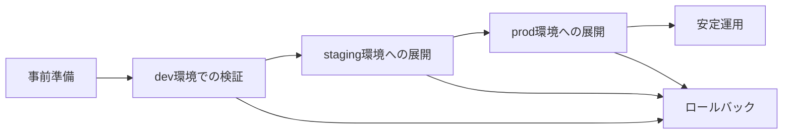

# Jenkins アップグレード Runbook

Jenkins のバージョン変更を計画的に実施するための手順書です。`latest` 指定での自動更新は行わず、LTS 固定バージョンを段階的に反映します。

## 対象と前提

- [ ] 対象は `pulumi/jenkins-ssm-init/index.ts` の `jenkins-version` パラメータ変更であることを確認する
- [ ] 変更対象の環境（`dev` / `staging` / `prod`）を明確にする
- [ ] 実施前に [Jenkins Upgrade Guide](https://www.jenkins.io/doc/upgrade-guide/) と [Jenkins LTS Changelog](https://www.jenkins.io/changelog-stable/) を確認する
- [ ] 本 Runbook に従わない緊急変更は、`CVE対応の特例` に該当する場合のみ許容する



## 事前準備

- [ ] 変更候補の Jenkins LTS バージョンを決定する
- [ ] 現在稼働中のバージョン以上であることを確認し、意図しないダウングレードを避ける
- [ ] [Jenkins Upgrade Guide](https://www.jenkins.io/doc/upgrade-guide/) の対象バージョン差分を確認する
- [ ] [Jenkins LTS Changelog](https://www.jenkins.io/changelog-stable/) で既知の注意点を確認する
- [ ] 利用中プラグインの互換性を確認する
- [ ] JCasC 設定差分、特にセキュリティ設定や廃止項目の有無を確認する
- [ ] 主要ジョブ一覧、監視観点、ロールバック条件を事前に共有する

```bash
# 作業前に変更対象を確認
grep -n 'jenkins-version' pulumi/jenkins-ssm-init/index.ts

# 変更後は SSM 初期化スタックを反映
cd ansible
ansible-playbook playbooks/jenkins/deploy/deploy_jenkins_ssm_init.yml -e "env=dev"
```

## dev環境での検証

- [ ] `pulumi/jenkins-ssm-init/index.ts` の `jenkins-version` を対象 LTS バージョンに変更する
- [ ] `deploy_jenkins_ssm_init.yml` を実行して SSM パラメータを更新する
- [ ] `deploy_jenkins_application.yml` を実行して Jenkins アプリケーション設定を反映する
- [ ] Jenkins UI にログインできることを確認する
- [ ] JCasC 適用結果にエラーがないことを確認する
- [ ] EC2 Fleet エージェントを使う主要ジョブを 1 件以上実行して成功させる
- [ ] ECS Fargate エージェントを使う主要ジョブを 1 件以上実行して成功させる
- [ ] `https://<jenkins-url>/monitoring` が応答することを確認する
- [ ] CloudWatch の CPU / メモリ系メトリクスに異常がないことを確認する
- [ ] 反映後 1 週間を目安に安定稼働を観察する

```bash
cd ansible

ansible-playbook playbooks/jenkins/deploy/deploy_jenkins_ssm_init.yml -e "env=dev"

ansible-playbook playbooks/jenkins/deploy/deploy_jenkins_application.yml -e "env=dev"
```

## staging環境への展開

- [ ] dev 環境の観察期間で重大な問題がなかったことを確認する
- [ ] dev で発生した差分や注意点を整理してから staging へ進める
- [ ] `deploy_jenkins_ssm_init.yml` を staging で実行する
- [ ] `deploy_jenkins_application.yml` を staging で実行する
- [ ] Jenkins UI / JCasC / 主要ジョブ / `/monitoring` を dev と同じ観点で確認する
- [ ] 3〜5 日程度の安定稼働観察期間を設ける

```bash
cd ansible

ansible-playbook playbooks/jenkins/deploy/deploy_jenkins_ssm_init.yml -e "env=staging"

ansible-playbook playbooks/jenkins/deploy/deploy_jenkins_application.yml -e "env=staging"
```

## prod環境への展開

- [ ] staging 環境の観察期間で問題がなかったことを確認する
- [ ] 影響の少ない時間帯を選定し、関係者へ作業時間を事前通知する
- [ ] prod 反映前にロールバック条件と担当者を再確認する
- [ ] `deploy_jenkins_ssm_init.yml` を prod で実行する
- [ ] `deploy_jenkins_application.yml` を prod で実行する
- [ ] Jenkins UI ログイン、JCasC、主要ジョブ、`/monitoring`、CloudWatch メトリクスを重点監視する
- [ ] 反映後 24 時間は集中監視する

```bash
cd ansible

ansible-playbook playbooks/jenkins/deploy/deploy_jenkins_ssm_init.yml -e "env=prod"

ansible-playbook playbooks/jenkins/deploy/deploy_jenkins_application.yml -e "env=prod"
```

## ロールバック手順

- [ ] 直前の安定バージョンを記録していることを確認する
- [ ] `pulumi/jenkins-ssm-init/index.ts` の `jenkins-version` を直前の安定バージョンへ戻す
- [ ] `deploy_jenkins_ssm_init.yml` を実行して SSM パラメータを復元する
- [ ] `deploy_jenkins_application.yml` を再実行して Jenkins を復旧する
- [ ] 失敗したプラグイン更新や JCasC 変更が同時に入っていないか確認する
- [ ] ロールバック後に Jenkins UI、主要ジョブ、`/monitoring`、CloudWatch メトリクスを再確認する

```bash
cd ansible

ansible-playbook playbooks/jenkins/deploy/deploy_jenkins_ssm_init.yml -e "env=prod"

ansible-playbook playbooks/jenkins/deploy/deploy_jenkins_application.yml -e "env=prod"
```

## CVE対応の特例

- [ ] 対象脆弱性が Critical または High で、かつ実際に悪用可能と判断された場合のみ特例を適用する
- [ ] 通常の観察期間を短縮する代わりに、事前確認と反映後監視を強化する
- [ ] 最低限 dev で起動確認、JCasC 確認、主要ジョブ 1 件ずつ、`/monitoring` 確認を実施する
- [ ] staging は短時間確認に留める場合でも、prod 反映前にロールバック条件を明文化する
- [ ] prod 反映後は 24 時間以上の重点監視を行う
- [ ] 緊急対応完了後に通常フローとの差分と判断理由を記録する

## 運用方針

- [ ] Jenkins バージョンは `latest` ではなく LTS 固定バージョンで管理する
- [ ] 通常のマイナー更新は月 1 回を目安に検討する
- [ ] LTS 系列変更を伴う更新は四半期ごとに計画し、事前検証を厚くする
- [ ] 変更時は必ず本 Runbook、`jenkins/README.md`、`docs/operations/jenkins-management.md` を相互参照する
- [ ] 変更履歴には、対象バージョン、確認した Changelog、検証結果、ロールバック要否を残す
