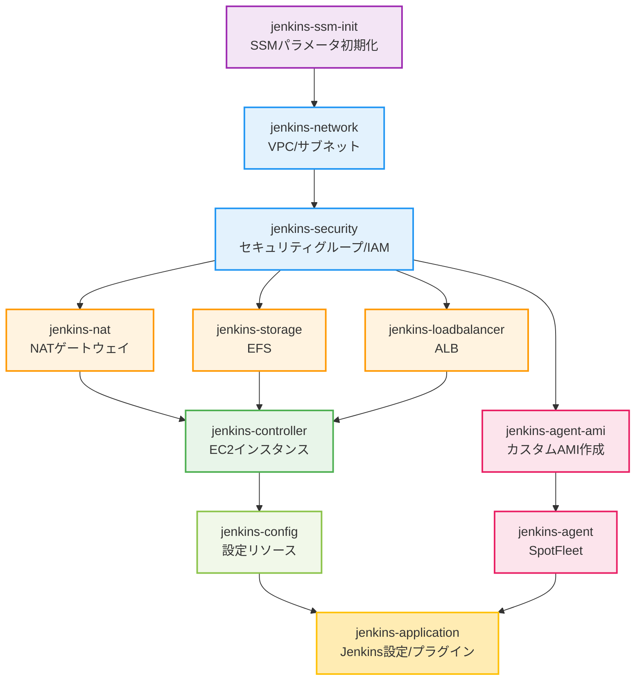

# Jenkinsインフラデプロイ

> 📖 **親ドキュメント**: [README.md](../../README.md)

## 概要

AnsibleでJenkins環境を初期構築する際の推奨手順、タグ運用、依存関係をまとめています。

### 5. Jenkinsインフラのデプロイ

#### 全体デプロイ（推奨）

Jenkins環境の初期構築には`jenkins_setup_pipeline.yml`を使用します。**実行時間が1時間以上かかる可能性があるため、tmuxの使用を強く推奨します**。

```bash
# tmuxセッションを作成してバックグラウンドで実行
tmux new-session -d -s jenkins-deploy

# コマンドを送信
tmux send-keys -t jenkins-deploy "cd ~/infrastructure-as-code/ansible" C-m
tmux send-keys -t jenkins-deploy "ansible-playbook playbooks/jenkins/jenkins_setup_pipeline.yml -e 'env=dev'" C-m

# 進捗を確認
tmux attach -t jenkins-deploy

# tmux操作方法
# デタッチ（バックグラウンドに戻す）: Ctrl+b, d
# 再アタッチ: tmux attach -t jenkins-deploy
# セッション一覧: tmux ls
```

**注意**: tmux内でPulumiが実行される際、進捗表示のエスケープシーケンス（`^[[A`、`^[[B`など）が文字として表示される場合があります。これは表示上の問題で、デプロイ処理には影響しません。

**デプロイ順序**（jenkins_setup_pipeline.ymlが自動的に実行）:
1. jenkins-ssm-init（SSMパラメータ初期化、パスワード生成）
2. jenkins-network（VPC、サブネット）
3. jenkins-security（セキュリティグループ、IAMロール）
4. jenkins-nat（NATゲートウェイ/インスタンス）
5. jenkins-storage（EFSファイルシステム）
6. jenkins-loadbalancer（ALB）
7. jenkins-controller（Jenkinsコントローラー）
8. jenkins-config（設定リソース）
9. jenkins-agent-ami（カスタムAMI作成、Dockerイメージ事前プル機能付き）※最大1時間
10. jenkins-agent（SpotFleet）
11. jenkins-application（Jenkins設定、プラグイン）

**実行時間の目安**:
- 基本インフラ: 約30-45分
- Agent AMI作成: 追加で最大1時間
- 合計: 1.5〜2時間

**トラブルシューティング**:
全体デプロイメント中にエラーが発生した場合、タグを使用して特定のコンポーネントのみを再実行できます：

```bash
# jenkins-agentのみ再実行
ansible-playbook playbooks/jenkins/jenkins_setup_pipeline.yml -e "env=dev" --tags agent

# jenkins-applicationのみ再実行
ansible-playbook playbooks/jenkins/jenkins_setup_pipeline.yml -e "env=dev" --tags application

# jenkins-agentとjenkins-applicationの両方を再実行
ansible-playbook playbooks/jenkins/jenkins_setup_pipeline.yml -e "env=dev" --tags agent,application
```

利用可能なタグ:
- `ssm-init`: SSMパラメータ初期化
- `network`: ネットワーク
- `security`: セキュリティグループ
- `nat`: NATゲートウェイ
- `storage`: EFSストレージ
- `loadbalancer`: ロードバランサー
- `controller`: Jenkinsコントローラー
- `config`: Jenkins設定
- `agent-ami`: Agent AMIビルド
- `agent`: Jenkinsエージェント
- `application`: Jenkinsアプリケーション設定

#### 個別コンポーネントのデプロイ

特定のコンポーネントのみを更新する場合は個別デプロイが可能ですが、**依存関係に注意が必要です**。

```bash
# 例: ネットワークのみ更新
ansible-playbook playbooks/jenkins/deploy/deploy_jenkins_network.yml -e "env=dev"

# 例: Jenkins Agent AMIのみ再作成（ビルドをスキップ）
ansible-playbook playbooks/jenkins/deploy/deploy_jenkins_agent_ami.yml -e "env=dev trigger_ami_build=false"

# 例: Jenkinsアプリケーション設定のみ更新
ansible-playbook playbooks/jenkins/deploy/deploy_jenkins_application.yml -e "env=dev"
```



**運用上の注意**:
- 上流コンポーネントを変更した場合、矢印の下流すべての再デプロイが必要
- 依存関係が不明な場合は全体デプロイ（jenkins_setup_pipeline.yml）を使用
- 個別デプロイは変更影響を完全に理解している場合のみ推奨

## 関連ドキュメント

- [Jenkins環境運用管理](jenkins-management.md)
- [インフラ削除](infrastructure-teardown.md)
- [README.md](../../README.md)
