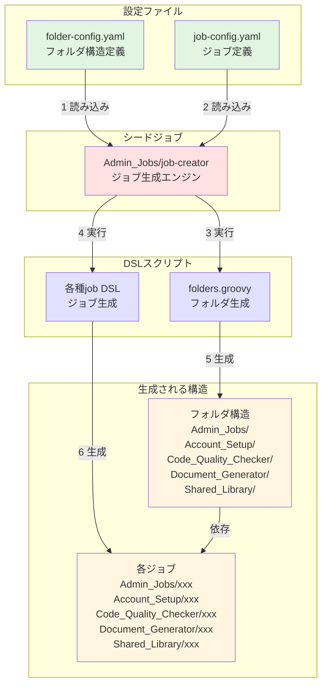

# Jenkins開発ガイド

Jenkinsジョブ、パイプライン、共有ライブラリの開発者向けガイドです。

## 📋 目次

- [開発環境](#開発環境)
- [ジョブ作成の開発フロー](#ジョブ作成の開発フロー)
- [コーディング規約](#コーディング規約)
- [Job DSL開発](#job-dsl開発)
- [パイプライン開発](#パイプライン開発)
- [共有ライブラリ開発](#共有ライブラリ開発)
- [テスト](#テスト)
- [ベストプラクティス](#ベストプラクティス)
- [トラブルシューティング](#トラブルシューティング)

## 開発環境

### ローカル開発環境

```bash
# Jenkins Test Harness (JTH) のセットアップ
git clone https://github.com/jenkinsci/jenkins-test-harness.git
cd jenkins-test-harness
mvn clean install

# ローカルJenkinsインスタンスの起動
docker run -d \
  -p 8080:8080 \
  -p 50000:50000 \
  -v jenkins_home:/var/jenkins_home \
  jenkins/jenkins:lts
```

### 必要なツール

- Jenkins 2.426.1以上
- Groovy 3.0以上
- Docker（テスト環境用）
- Git
- IDE（IntelliJ IDEA推奨）

### IDE設定（IntelliJ IDEA）

```xml
<!-- .idea/libraries/Jenkins_Pipeline.xml -->
<component name="libraryTable">
  <library name="Jenkins Pipeline">
    <CLASSES>
      <root url="jar://$PROJECT_DIR$/libs/workflow-cps.jar!/" />
      <root url="jar://$PROJECT_DIR$/libs/workflow-api.jar!/" />
    </CLASSES>
  </library>
</component>
```

## ジョブ作成の開発フロー

### 概要

Jenkinsのジョブは**シードジョブパターン**で管理されています。シードジョブ（`Admin_Jobs/job-creator`）が設定ファイル（`job-config.yaml`）を読み取り、定義されたDSLスクリプトとJenkinsfileを使用して全ジョブを自動生成します。

### アーキテクチャ



#### 処理フロー

1. **フォルダ設定読み込み**: `folder-config.yaml`からフォルダ構造を読み込み
2. **ジョブ設定読み込み**: `job-config.yaml`からジョブ定義を読み込み
3. **フォルダ生成**: `folders.groovy`が最初に実行されフォルダ構造を作成
4. **ジョブ生成**: 各DSLファイルが実行されジョブを生成
5. **依存関係**: ジョブはフォルダ内に配置されるため、フォルダが先に必要

### 新規ジョブ作成手順

#### ステップ1: job-config.yamlへジョブ定義を追加

```yaml
# jenkins/jobs/pipeline/_seed/job-creator/job-config.yaml

jenkins-jobs:
  # 既存のジョブ定義...
  
  # 新規ジョブを追加
  your_new_job:
    name: 'Your_Job_Name'              # Jenkins上での実際のジョブ名
    displayName: 'Your Job Display'    # 表示名
    dslfile: jenkins/jobs/dsl/category/your_job.groovy      # DSLファイルパス
    jenkinsfile: jenkins/jobs/pipeline/category/your-job/Jenkinsfile  # Jenkinsfileパス
```

#### ステップ2: Job DSLスクリプトを作成

```groovy
// jenkins/jobs/dsl/category/your_job.groovy

// 共通設定を取得
def jenkinsPipelineRepo = commonSettings['jenkins-pipeline-repo']

// ジョブ設定を取得
def jobKey = 'your_new_job'  // job-config.yamlのキーと一致させる
def jobConfig = jenkinsJobsConfig[jobKey]

// フォルダとジョブ名を組み合わせる
def fullJobName = "Category_Name/${jobConfig.name}"

pipelineJob(fullJobName) {
    displayName(jobConfig.displayName)
    
    description('ジョブの説明')
    
    // ビルド履歴の保持設定
    logRotator {
        daysToKeep(30)
        numToKeep(30)
    }
    
    // ⚠️ 重要: パラメータは必ずDSLで定義すること
    // Jenkinsfileでのパラメータ定義は禁止
    parameters {
        stringParam('PARAMETER_NAME', 'default_value', '説明')
        choiceParam('ENVIRONMENT', ['dev', 'staging', 'prod'], '実行環境')
        booleanParam('DRY_RUN', false, 'ドライラン実行')
    }
    
    // パイプライン定義
    definition {
        cpsScm {
            scm {
                git {
                    remote {
                        url(jenkinsPipelineRepo.url)
                        credentials(jenkinsPipelineRepo.credentials)
                    }
                    branch(jenkinsPipelineRepo.branch)
                }
            }
            scriptPath(jobConfig.jenkinsfile)
        }
    }
}
```

#### ステップ3: Jenkinsfileを作成

```groovy
// jenkins/jobs/pipeline/category/your-job/Jenkinsfile

@Library('jenkins-shared-library@main') _

pipeline {
    agent {
        label 'your-agent-label'
    }
    
    // ⚠️ 重要: parametersブロックは使用禁止！
    // パラメータはDSLファイルで定義すること
    // NG例:
    // parameters {
    //     string(name: 'PARAMETER_NAME', defaultValue: 'default', description: '説明')
    // }
    
    environment {
        // 環境変数
    }
    
    stages {
        stage('Initialize') {
            steps {
                echo "Starting job: ${env.JOB_NAME}"
                // DSLで定義したパラメータを使用
                echo "Parameter value: ${params.PARAMETER_NAME}"
                echo "Environment: ${params.ENVIRONMENT}"
            }
        }
        
        stage('Main Process') {
            steps {
                script {
                    // メイン処理
                    if (params.DRY_RUN) {
                        echo "Dry run mode - skipping actual execution"
                    } else {
                        // 実際の処理
                    }
                }
            }
        }
        
        stage('Cleanup') {
            steps {
                cleanWs()
            }
        }
    }
    
    post {
        success {
            echo 'Job completed successfully'
        }
        failure {
            echo 'Job failed'
        }
    }
}
```

#### ステップ4: シードジョブを実行

```bash
# Jenkins UIから
1. Admin_Jobs/job-creator にアクセス
2. 「ビルド実行」をクリック
3. コンソール出力でジョブ生成を確認

# または Jenkins CLIから
java -jar jenkins-cli.jar -s http://jenkins.example.com \
  build Admin_Jobs/job-creator
```

### フォルダ構造の管理

フォルダ構造は設定ファイル駆動型で管理されています。新しいフォルダカテゴリが必要な場合は、`folder-config.yaml`を更新：

#### folder-config.yamlの構造

```yaml
# jenkins/jobs/pipeline/_seed/job-creator/folder-config.yaml

# 静的フォルダ定義
folders:
  - path: "New_Category"
    displayName: "New Category Display Name"
    description: |
      フォルダの説明
      
      ### 概要
      このフォルダーの目的

  - path: "Parent/Child"  # 階層構造も自動処理
    displayName: "Child Folder"
    description: "サブフォルダの説明"

# 動的フォルダ生成ルール
dynamic_folders:
  - parent_path: "Code_Quality_Checker"
    source: "jenkins-managed-repositories"  # job-config.yamlのリポジトリ定義から生成
    template:
      path_suffix: "{name}"  # {name}はリポジトリ名に置換
      displayName: "Code Quality - {name}"
      description: |
        {name}リポジトリのコード品質チェックジョブ
```

#### フォルダ生成の仕組み

1. **設定ファイル読み込み**: シードジョブが`folder-config.yaml`を読み込む
2. **folders.groovy実行**: 設定をもとに`folders.groovy`がフォルダを生成
3. **階層自動処理**: 親フォルダが存在しない場合は自動作成
4. **動的生成**: `jenkins-managed-repositories`などから動的にフォルダを生成

#### フォルダ追加手順

```bash
# 1. folder-config.yamlを編集
vi jenkins/jobs/pipeline/_seed/job-creator/folder-config.yaml

# 2. 静的フォルダを追加（例）
folders:
  - path: "Infrastructure"
    displayName: "Infrastructure Jobs"
    description: |
      インフラストラクチャ関連のジョブ

# 3. シードジョブを実行してフォルダ生成
# Jenkins UI: Admin_Jobs/job-creator を実行
```

### ⚠️ 重要: パラメータ定義のルール

**このプロジェクトでは、Jenkinsfileでのパラメータ定義は禁止されています。**

#### 理由

Jenkinsfileにパラメータを定義した場合、シードジョブで自動生成されたジョブを初回実行する際に以下の問題が発生します：

1. **初回実行時の問題**: パラメータが認識されず、パラメータ指定ができない
2. **パラメータ反映の遅延**: 初回実行後にようやくパラメータが反映される
3. **運用上の混乱**: 初回と2回目以降で動作が異なる

#### 正しい実装方法

```groovy
// ✅ 正しい: DSLファイルでパラメータを定義
// jenkins/jobs/dsl/category/your_job.groovy
pipelineJob(fullJobName) {
    parameters {
        stringParam('VERSION', '1.0.0', 'バージョン番号')
        choiceParam('ENVIRONMENT', ['dev', 'staging', 'prod'], '実行環境')
        booleanParam('SKIP_TESTS', false, 'テストをスキップ')
        textParam('CONFIG', '', '追加設定（YAML形式）')
    }
    // ...
}

// Jenkinsfileではparams.XXXで参照するのみ
pipeline {
    stages {
        stage('Process') {
            steps {
                echo "Version: ${params.VERSION}"
                echo "Environment: ${params.ENVIRONMENT}"
            }
        }
    }
}
```

```groovy
// ❌ 間違い: Jenkinsfileでパラメータを定義
pipeline {
    parameters {  // これは禁止！
        string(name: 'VERSION', defaultValue: '1.0.0')
    }
}
```

#### 開発段階での例外

開発・テスト段階では、以下の条件でJenkinsfileでのパラメータ定義を許容します：

1. **Playgroundsフォルダ内のジョブ**: 個人の実験用
2. **テストジョブ**: `*_test`サフィックスのジョブ
3. **一時的な検証**: PRレビュー前の動作確認

ただし、本番環境へのマージ前には必ずDSLファイルに移行すること。

### 設定の検証

シードジョブは自動的に以下を検証します：

1. **DSLファイルの存在確認**: 指定されたパスにDSLファイルが存在するか
2. **Jenkinsfileの存在確認**: 指定されたパスにJenkinsfileが存在するか
3. **folder-config.yamlの存在確認**: フォルダ設定ファイルが存在するか
4. **構文チェック**: Groovy構文の妥当性
5. **依存関係チェック**: 必要なライブラリやクレデンシャルの存在
6. **パラメータ定義の確認**: DSLでパラメータが適切に定義されているか

#### folders.groovyの実装詳細

```groovy
// jenkins/jobs/dsl/folders.groovy
// このファイルは設定ファイルから自動的にフォルダを生成

// Jenkinsfileから設定を受け取る
def folderConfig = binding.hasVariable('jenkinsFoldersConfig') ? 
    binding.getVariable('jenkinsFoldersConfig') : 
    [:]

// 1. 静的フォルダの作成
if (folderConfig.folders) {
    // 階層順にソート（親→子）
    def sortedFolders = folderConfig.folders.sort { a, b -> 
        a.path.count('/') - b.path.count('/')
    }
    
    sortedFolders.each { folderDef ->
        folder(folderDef.path) {
            displayName(folderDef.displayName)
            description(folderDef.description)
        }
    }
}

// 2. 動的フォルダの作成
if (folderConfig.dynamic_folders) {
    folderConfig.dynamic_folders.each { rule ->
        // リポジトリベースの動的生成など
    }
}
```

### よくあるパターン

#### GitHub連携ジョブ

```yaml
# job-config.yaml
github_triggered_job:
  name: 'GitHub_Triggered_Job'
  displayName: 'GitHub Triggered Job'
  dslfile: jenkins/jobs/dsl/category/github_job.groovy
  jenkinsfile: jenkins/jobs/pipeline/category/github-job/Jenkinsfile
  github_trigger: true  # GitHub Webhookトリガーを有効化
```

#### 定期実行ジョブ

```groovy
// DSLファイル
pipelineJob(fullJobName) {
    triggers {
        cron('H 2 * * *')  // 毎日2時に実行
    }
    // 他の設定...
}
```

#### Freestyleジョブ（非同期トリガー専用）

既存のジョブを**非同期で**トリガーする場合にFreestyleジョブを使用します。同期実行が必要な場合はPipelineジョブを使用してください。

##### Freestyleジョブの使用場面

- ✅ **スケジューラージョブ** - 定期実行で他のジョブをトリガー
- ✅ **通知専用ジョブ** - 結果を待たずに通知を送信
- ✅ **自己停止処理** - Jenkinsが自身を停止する場合
- ❌ **順次実行** - Pipelineジョブを使用
- ❌ **結果の確認が必要** - Pipelineジョブを使用
- ❌ **複雑な条件分岐** - Pipelineジョブを使用

##### 非同期実行パターン（推奨）

```groovy
// DSLファイル - ポストビルドで非同期実行
freeStyleJob(fullJobName) {
    displayName('非同期トリガージョブ')
    description('他のジョブを非同期でトリガー')
    
    // 並行実行を無効化
    concurrentBuild(false)
    
    // ビルドステップは最小限に
    steps {
        shell('echo "ジョブをトリガーします..."')
    }
    
    // ポストビルドアクションで非同期トリガー
    publishers {
        downstreamParameterized {
            trigger('Target/Job/Path') {
                // 実行条件
                condition('ALWAYS')  // または 'SUCCESS', 'UNSTABLE', 'FAILED'
                
                // パラメータ設定
                parameters {
                    predefinedProp('PARAM1', 'value1')
                    predefinedProp('PARAM2', 'value2')
                    booleanParam('FLAG', true)
                }
                
                // 結果を待たない（非同期）
                triggerWithNoParameters(false)
            }
        }
    }
}
```

##### ジョブタイプの選択基準

| ジョブタイプ | 使用場面 | メリット | デメリット |
|------------|---------|---------|-----------|
| **Freestyle + 非同期** | スケジューラー<br>単純なトリガー<br>自己停止処理 | シンプル<br>即座に完了<br>キューに残らない | 結果の確認が困難<br>複雑な処理は不可 |
| **Pipeline + 同期** | 順次実行<br>結果確認が必要<br>複雑な処理フロー | 柔軟な制御<br>エラーハンドリング<br>ステージ管理 | 設定が複雑<br>実行時間が長い |

⚠️ **重要**: Freestyleジョブで同期実行（結果を待つ）は推奨しません。同期実行が必要な場合はPipelineジョブを使用してください。

##### 実装上の注意点

```groovy
// ⚠️ 非同期実行時の注意
// 1. エラーが発生してもトリガー元は成功扱い
// 2. トリガー先の実行状況は別途確認が必要
// 3. パラメータの検証はトリガー先で実施

// 推奨: ログに実行情報を記録
steps {
    shell("""
        echo "========================================="
        echo "トリガー対象: Target/Job/Path"
        echo "パラメータ:"
        echo "  PARAM1: value1"
        echo "  PARAM2: value2"
        echo "実行時刻: \$(date)"
        echo "========================================="
    """)
}
```

// 注意: FreestyleジョブにはJenkinsfileは不要
// job-config.yamlでの定義例:
// my_freestyle_job:
//   name: 'My_Freestyle_Job'
//   dslfile: jenkins/jobs/dsl/category/my_freestyle_job.groovy
//   # jenkinsfile: 不要（freestyleジョブ）
```

#### スケジューラージョブのパターン

定期的に他のジョブをトリガーする場合は、必ずFreestyleジョブ + 非同期実行を使用：

```groovy
// DSLファイル - スケジューラージョブ
freeStyleJob(fullJobName) {
    displayName('自動実行スケジューラー')
    description('''
        |定期実行の説明
        |実行タイミング: 毎日午前0時
        |対象: 開発環境のみ
    '''.stripMargin())
    
    // トリガー設定（cronフォーマット）
    triggers {
        // Jenkins cron: 分 時 日 月 曜日
        // H: ハッシュ（負荷分散）
        // 例: 日本時間午前0時（UTC 15:00）、平日のみ
        cron('H 15 * * 1-5')  // UTC 15:00 = JST 00:00
        
        // その他の例:
        // cron('H 2 * * *')     // 毎日2時頃
        // cron('H H * * 0')     // 毎週日曜日
        // cron('H 9-17 * * 1-5') // 平日9-17時の間で1時間ごと
    }
    
    // 固定パラメータで他ジョブを実行
    steps {
        downstreamParameterized {
            trigger('Path/To/Target/Job') {
                parameters {
                    // スケジュール実行では固定値を使用
                    predefinedProp('ENVIRONMENT', 'dev')
                    predefinedProp('MODE', 'auto')
                    predefinedProp('CONFIRM', 'true')
                }
            }
        }
    }
    
    // 環境変数（タイムゾーン設定など）
    environmentVariables {
        env('TZ', 'Asia/Tokyo')
    }
}
```

##### スケジューラージョブの設計原則

1. **パラメータは固定値**: スケジュール実行では変更できないため
2. **Freestyleジョブを使用**: シンプルなトリガー処理に最適
3. **タイムゾーンを明示**: 特に国際的な環境では重要
4. **実行対象を限定**: 本番環境の自動操作は避ける
5. **ログ保持期間を長めに**: トラブルシューティング用

##### Cron式のタイムゾーン注意点

```groovy
// JenkinsのcronはUTCベース
// 日本時間（JST = UTC+9）への変換が必要

// 日本時間での設定例:
// JST 00:00 = UTC 15:00 (前日)
// JST 09:00 = UTC 00:00
// JST 18:00 = UTC 09:00

cron('0 15 * * *')   // 日本時間 午前0時
cron('0 0 * * *')    // 日本時間 午前9時
cron('0 9 * * *')    // 日本時間 午後6時
```

#### パラメータ化ジョブ

```groovy
// DSLファイル（パラメータは必ずここで定義）
pipelineJob(fullJobName) {
    parameters {
        // 文字列パラメータ
        stringParam('VERSION', '1.0.0', 'デプロイするバージョン')
        
        // 選択肢パラメータ
        choiceParam('ENVIRONMENT', ['dev', 'staging', 'prod'], '実行環境')
        
        // ブール値パラメータ
        booleanParam('DRY_RUN', false, 'ドライラン実行')
        
        // テキストパラメータ（複数行）
        textParam('CUSTOM_CONFIG', '', 'カスタム設定（YAML形式）')
        
        // パスワードパラメータ
        nonStoredPasswordParam('SECRET_TOKEN', 'APIトークン')
    }
    // 他の設定...
}

// Jenkinsfile（パラメータの使用のみ、定義は禁止）
pipeline {
    stages {
        stage('Use Parameters') {
            steps {
                script {
                    echo "Version: ${params.VERSION}"
                    if (params.DRY_RUN) {
                        echo "Running in dry-run mode"
                    }
                }
            }
        }
    }
}
```

### トラブルシューティング

| 問題 | 原因 | 解決方法 |
|-----|------|---------|
| ジョブが生成されない | job-config.yamlの構文エラー | YAMLリンターで検証、インデント確認 |
| DSLエラー | Groovy構文エラー | Jenkins Script Consoleでテスト |
| Jenkinsfile not found | パス指定ミス | scriptPathとファイルパスの一致確認 |
| 権限エラー | Job DSL権限不足 | Script Securityで承認 |

## コーディング規約

### Groovy規約

```groovy
// ファイル命名規則
// - Job DSL: {component}_{action}_job.groovy
// - Pipeline: Jenkinsfile
// - Library: PascalCase.groovy (クラス名と一致)

// インデント: スペース4文字
// 行の最大長: 120文字

// クラス定義
class MyUtility implements Serializable {
    private static final String DEFAULT_VALUE = "default"
    
    // プロパティは private + getter/setter
    private String name
    
    String getName() {
        return this.name
    }
    
    void setName(String name) {
        this.name = name
    }
}

// メソッド定義
def processData(Map config) {
    // 必須パラメータのチェック
    assert config.input : "Input is required"
    
    // 処理
    return config.input.toUpperCase()
}
```

### 命名規則

```groovy
// Job DSL
pipelineJob('Category_Name/job-name') {
    displayName('ジョブ表示名')
}

// Pipeline stages
stage('Setup Environment') { }
stage('Run Tests') { }
stage('Deploy Application') { }

// 共有ライブラリメソッド
def deployToEnvironment(Map args) { }
def validateConfiguration(Map config) { }
```

## Job DSL開発

### Job DSL構造

```groovy
// jobs/dsl/{category}/{job_name}_job.groovy

// インポート
import javaposse.jobdsl.dsl.Job

// ジョブ定義
pipelineJob('Category/job-name') {
    // 表示設定
    displayName('ジョブ表示名')
    description('''
        ジョブの詳細説明
        - 機能1
        - 機能2
    '''.stripIndent())
    
    // パラメータ定義
    parameters {
        stringParam('BRANCH', 'main', 'ブランチ名')
        choiceParam('ENVIRONMENT', ['dev', 'staging', 'prod'], '環境')
        booleanParam('SKIP_TESTS', false, 'テストをスキップ')
    }
    
    // トリガー設定
    triggers {
        cron('H 2 * * *')
        githubPush()
    }
    
    // Pipeline定義
    definition {
        cpsScm {
            scm {
                git {
                    remote {
                        url('https://github.com/org/repo.git')
                        credentials('github-credentials')
                    }
                    branches('*/\${BRANCH}')
                }
            }
            scriptPath('jobs/pipeline/category/job-name/Jenkinsfile')
        }
    }
    
    // プロパティ設定
    properties {
        buildDiscarder {
            logRotator {
                daysToKeep(30)
                numToKeep(10)
                artifactDaysToKeep(7)
                artifactNumToKeep(5)
            }
        }
        
        githubProjectUrl('https://github.com/org/repo')
    }
}
```

### フォルダー構造定義（設定ファイル駆動型）

```yaml
# folder-config.yamlで定義（設定ファイル駆動型）
folders:
  - path: "Admin_Jobs"
    displayName: "管理ジョブ"
    description: "システム管理用のジョブ群"
    
  - path: "CI_CD"
    displayName: "CI/CDパイプライン"
    description: "継続的インテグレーション/デプロイメント"
    
  - path: "Testing"
    displayName: "テストジョブ"
    description: "各種テスト実行用"

# 動的フォルダ生成
dynamic_folders:
  - parent_path: "Testing"
    source: "jenkins-managed-repositories"
    template:
      path_suffix: "{name}"
      displayName: "Test - {name}"
      description: "{name}リポジトリのテスト"
```

folders.groovyは設定を読み込んで自動的にフォルダを生成します。

### 動的ジョブ生成

```groovy
// 環境ごとのジョブを動的生成
def environments = ['dev', 'staging', 'prod']
def applications = ['web', 'api', 'batch']

environments.each { env ->
    applications.each { app ->
        pipelineJob("Deploy/${app}-${env}") {
            displayName("${app.toUpperCase()} ${env}環境デプロイ")
            
            parameters {
                stringParam('VERSION', '', 'デプロイバージョン')
            }
            
            definition {
                cps {
                    script("""
                        pipeline {
                            agent any
                            stages {
                                stage('Deploy') {
                                    steps {
                                        echo 'Deploying ${app} to ${env}'
                                    }
                                }
                            }
                        }
                    """.stripIndent())
                }
            }
        }
    }
}
```

## パイプライン開発

### Groovy内でのBashコマンド実行

#### 重要な注意事項

Jenkins PipelineのGroovy内でBashコマンドを実行する際、文字列処理とエスケープに関して注意が必要です。

#### 1. 文字列リテラルの使い分け

```groovy
// ❌ 問題のあるパターン：複数行文字列（"""）内での変数展開
sh """
    aws ec2 describe-instances \
        --filters "Name=tag:Environment,Values=${ENVIRONMENT}" \
        --query 'Reservations[*].Instances[*].Tags[?Key==\`Name\`]' \
        --output json
"""
// 問題点：
// - Groovy変数の展開タイミング
// - クエリ内のバッククォートエスケープ
// - ダブルクォート内のシングルクォート処理

// ✅ 推奨パターン1：文字列連結を使用
sh '''
    aws ec2 describe-instances \
        --filters "Name=tag:Environment,Values=''' + ENVIRONMENT + '''" \
        --query 'Reservations[*].Instances[*].Tags[?Key==`Name`]' \
        --output json
'''
// 利点：
// - Groovy変数は明示的に連結
// - バッククォートのエスケープ不要
// - 引用符の階層が明確

// ✅ 推奨パターン2：環境変数経由
sh '''
    aws ec2 describe-instances \
        --filters "Name=tag:Environment,Values=${ENVIRONMENT}" \
        --query 'Reservations[*].Instances[*].Tags[?Key==`Name`]' \
        --output json
'''
// 前提：ENVIRONMENT が environment ブロックで定義済み
```

#### 2. 変数展開のタイミング

```groovy
// Groovy変数とBash変数の違いを理解する

def groovyVar = "value1"
env.ENV_VAR = "value2"

// ❌ 混在は避ける
sh """
    echo "${groovyVar}"     # Groovyによる展開
    echo "\${ENV_VAR}"      # Bashによる展開（エスケープ必要）
"""

// ✅ 明確に分離
sh '''
    echo "''' + groovyVar + '''"    # Groovy変数は連結
    echo "${ENV_VAR}"                # 環境変数はBashで展開
'''
```

#### 3. AWS CLIクエリのエスケープ

```groovy
// JMESPathクエリを含むAWS CLIコマンドの場合

// ❌ エスケープ地獄
sh """
    aws ec2 describe-instances \
        --query 'Reservations[0].Instances[0].Tags[?Key==\`Name\`]|[0].Value' \
        --output text
"""

// ✅ シンプルな引用符使用
sh '''
    aws ec2 describe-instances \
        --query 'Reservations[0].Instances[0].Tags[?Key==`Name`]|[0].Value' \
        --output text
'''

// ✅ 複雑なクエリは変数に分離
def query = 'Reservations[0].Instances[0].Tags[?Key==`Name`]|[0].Value'
sh """
    aws ec2 describe-instances \
        --query '${query}' \
        --output text
"""
```

#### 4. 複数のインスタンスIDを扱う場合

```groovy
// ✅ リストから文字列への変換
def instanceIds = ['i-123', 'i-456', 'i-789']
def instanceIdsString = instanceIds.join(' ')

sh """
    aws ec2 stop-instances \
        --instance-ids ${instanceIdsString} \
        --region ${AWS_REGION}
"""
```

#### 5. デバッグのコツ

```groovy
// コマンドを事前に確認
def command = """
    aws ec2 describe-instances \
        --filters "Name=tag:Environment,Values=${ENVIRONMENT}" \
        --region ${AWS_REGION}
"""
echo "実行するコマンド: ${command}"
sh command

// または dry-run モードを活用
sh """
    set -x  # デバッグ出力を有効化
    aws ec2 describe-instances \
        --filters "Name=tag:Environment,Values=${ENVIRONMENT}" \
        --region ${AWS_REGION}
"""
```

### 関数分離によるパイプラインの構造化

#### 推奨パターン

Jenkinsfileの可読性と保守性を向上させるため、ビジネスロジックを関数として分離します。

```groovy
// ========================
// 関数定義セクション
// ========================

/**
 * パラメータの検証
 * @return void
 * @throws error パラメータが不正な場合
 */
def validateParameters() {
    if (!params.REQUIRED_PARAM) {
        error("必須パラメータが設定されていません")
    }
    echo "パラメータ検証完了"
}

/**
 * AWS CLIを使用してリソース情報を取得
 * @param resourceId リソースID
 * @return String リソースの状態
 */
def getResourceStatus(String resourceId) {
    return sh(
        script: """
            aws ec2 describe-instances \
                --instance-ids ${resourceId} \
                --query 'Reservations[0].Instances[0].State.Name' \
                --output text
        """.stripIndent(),
        returnStdout: true
    ).trim()
}

/**
 * 複雑な処理をオーケストレーション
 */
def executeComplexProcess() {
    try {
        def status = getResourceStatus(env.INSTANCE_ID)
        if (status == 'running') {
            performAction()
        }
    } catch (Exception e) {
        handleError(e)
    }
}

// ========================
// パイプライン定義
// ========================
pipeline {
    agent any
    
    stages {
        stage('Validate') {
            steps {
                script {
                    validateParameters()
                }
            }
        }
        
        stage('Process') {
            steps {
                script {
                    executeComplexProcess()
                }
            }
        }
    }
}
```

#### 関数分離のメリット

1. **単一責任原則**: 各関数は1つの明確な責任を持つ
2. **再利用性**: 共通処理を関数化して複数箇所から呼び出し可能
3. **テスタビリティ**: 関数単位でのテストが容易
4. **可読性**: パイプラインのステージが簡潔になる
5. **保守性**: 変更が必要な箇所が明確

### 複数行文字列の処理

#### stripIndent() と stripMargin() の使い分け

```groovy
// 1. stripIndent() - インデントを除去
// AWS CLIコマンドなど、実行時にインデントが不要な場合
def executeCommand() {
    sh """
        aws s3 cp \
            --recursive \
            --exclude "*.tmp" \
            s3://source-bucket/ \
            s3://dest-bucket/
    """.stripIndent()
}

// 2. stripMargin() - マージン文字（|）を基準に整形
// ログ出力やレポートなど、フォーマットを保持したい場合
def showReport() {
    echo """
        |===================================
        |デプロイメント完了レポート
        |===================================
        |
        |環境: ${env.ENVIRONMENT}
        |バージョン: ${env.VERSION}
        |
        |実行結果:
        |  - ビルド: 成功
        |  - テスト: 成功
        |  - デプロイ: 成功
        |===================================
    """.stripMargin()
}

// 3. 組み合わせパターン
def generateYamlConfig() {
    return """
        |apiVersion: v1
        |kind: ConfigMap
        |metadata:
        |  name: ${APP_NAME}-config
        |data:
        |  database_url: ${DB_URL}
        |  cache_enabled: "true"
        |  log_level: "info"
    """.stripMargin()
}
```

#### 使用上の注意点

```groovy
// ❌ 避けるべきパターン
sh """
aws ec2 describe-instances \
    --filters "Name=tag:Environment,Values=${ENV}" \
    --query 'Reservations[*].Instances[*]'
"""
// 問題: インデントがそのままコマンドに含まれる

// ✅ 推奨パターン
sh """
    aws ec2 describe-instances \
        --filters "Name=tag:Environment,Values=${ENV}" \
        --query 'Reservations[*].Instances[*]'
""".stripIndent()
// 解決: stripIndent()でインデントを除去

// マージンを使った表示の例
echo """
    |エラーが発生しました:
    |  ファイル: ${filename}
    |  行番号: ${lineNumber}
    |  詳細: ${errorMessage}
""".stripMargin()
```

### Declarative Pipeline

```groovy
// Jenkinsfile
pipeline {
    agent {
        label 'docker && linux'
    }
    
    options {
        timestamps()
        ansiColor('xterm')
        timeout(time: 1, unit: 'HOURS')
        buildDiscarder(logRotator(numToKeep: 10))
        skipDefaultCheckout()
        disableConcurrentBuilds()
    }
    
    environment {
        AWS_REGION = 'ap-northeast-1'
        MAVEN_OPTS = '-Xmx1024m'
        GITHUB_TOKEN = credentials('github-token')
    }
    
    parameters {
        string(name: 'VERSION', defaultValue: '', description: 'ビルドバージョン')
        choice(name: 'TARGET', choices: ['all', 'backend', 'frontend'], description: 'ビルド対象')
    }
    
    stages {
        stage('Checkout') {
            steps {
                checkout scm
            }
        }
        
        stage('Build') {
            parallel {
                stage('Backend') {
                    when {
                        expression { params.TARGET in ['all', 'backend'] }
                    }
                    steps {
                        dir('backend') {
                            sh './gradlew build'
                        }
                    }
                }
                
                stage('Frontend') {
                    when {
                        expression { params.TARGET in ['all', 'frontend'] }
                    }
                    steps {
                        dir('frontend') {
                            sh 'npm ci && npm run build'
                        }
                    }
                }
            }
        }
        
        stage('Test') {
            steps {
                sh './run-tests.sh'
                junit '**/target/test-results/**/*.xml'
            }
        }
        
        stage('Deploy') {
            when {
                branch 'main'
                expression { currentBuild.result == null || currentBuild.result == 'SUCCESS' }
            }
            input {
                message '本番環境へデプロイしますか？'
                ok 'デプロイ実行'
                parameters {
                    choice(name: 'CONFIRM', choices: ['yes', 'no'], description: '確認')
                }
            }
            steps {
                script {
                    if (params.CONFIRM == 'yes') {
                        sh './deploy.sh prod'
                    }
                }
            }
        }
    }
    
    post {
        always {
            cleanWs()
        }
        success {
            slackSend(color: 'good', message: "ビルド成功: ${env.JOB_NAME} #${env.BUILD_NUMBER}")
        }
        failure {
            slackSend(color: 'danger', message: "ビルド失敗: ${env.JOB_NAME} #${env.BUILD_NUMBER}")
        }
    }
}
```

### Scripted Pipeline

```groovy
// Scripted Pipelineの例
node('docker') {
    try {
        stage('Checkout') {
            checkout scm
        }
        
        stage('Build') {
            docker.image('maven:3.8-jdk-11').inside {
                sh 'mvn clean package'
            }
        }
        
        stage('Test') {
            parallel(
                'Unit Tests': {
                    sh './run-unit-tests.sh'
                },
                'Integration Tests': {
                    sh './run-integration-tests.sh'
                },
                'Lint': {
                    sh './run-lint.sh'
                }
            )
        }
        
        if (env.BRANCH_NAME == 'main') {
            stage('Deploy') {
                input 'Deploy to production?'
                sh './deploy-prod.sh'
            }
        }
    } catch (Exception e) {
        currentBuild.result = 'FAILURE'
        throw e
    } finally {
        stage('Cleanup') {
            cleanWs()
        }
    }
}
```

## 共有ライブラリ開発

### ライブラリ構造

```
jobs/shared/
├── src/
│   └── jp/co/tielec/jenkins/
│       ├── utils/
│       │   ├── GitUtils.groovy
│       │   ├── DockerUtils.groovy
│       │   └── AwsUtils.groovy
│       ├── steps/
│       │   ├── BuildStep.groovy
│       │   └── DeployStep.groovy
│       └── models/
│           ├── BuildConfig.groovy
│           └── DeployConfig.groovy
├── vars/
│   ├── gitUtils.groovy
│   ├── dockerUtils.groovy
│   └── standardPipeline.groovy
├── resources/
│   └── templates/
│       └── email.html
└── test/
    └── unit/
        └── GitUtilsTest.groovy
```

### クラスライブラリ

```groovy
// src/jp/co/tielec/jenkins/utils/GitUtils.groovy
package jp.co.tielec.jenkins.utils

class GitUtils implements Serializable {
    private def script
    
    GitUtils(def script) {
        this.script = script
    }
    
    String getCurrentBranch() {
        return script.sh(
            script: 'git rev-parse --abbrev-ref HEAD',
            returnStdout: true
        ).trim()
    }
    
    String getCommitHash(Boolean shortHash = false) {
        def flag = shortHash ? '--short' : ''
        return script.sh(
            script: "git rev-parse ${flag} HEAD",
            returnStdout: true
        ).trim()
    }
    
    List<String> getChangedFiles(String baseRef = 'HEAD~1') {
        def output = script.sh(
            script: "git diff --name-only ${baseRef}",
            returnStdout: true
        ).trim()
        
        return output.split('\n').toList()
    }
    
    Boolean hasChangesIn(String path, String baseRef = 'HEAD~1') {
        def changedFiles = getChangedFiles(baseRef)
        return changedFiles.any { it.startsWith(path) }
    }
}
```

### グローバル変数

```groovy
// vars/gitUtils.groovy
import jp.co.tielec.jenkins.utils.GitUtils

def checkoutWithSubmodules(Map config = [:]) {
    def defaultConfig = [
        branch: 'main',
        credentialsId: 'github-credentials',
        url: ''
    ]
    
    def finalConfig = defaultConfig + config
    
    checkout([
        $class: 'GitSCM',
        branches: [[name: finalConfig.branch]],
        extensions: [
            [$class: 'SubmoduleOption',
             disableSubmodules: false,
             parentCredentials: true,
             recursiveSubmodules: true,
             reference: '',
             trackingSubmodules: false]
        ],
        userRemoteConfigs: [[
            credentialsId: finalConfig.credentialsId,
            url: finalConfig.url
        ]]
    ])
}

def tagRelease(String version) {
    def utils = new GitUtils(this)
    def currentBranch = utils.getCurrentBranch()
    
    if (currentBranch != 'main') {
        error "Releases can only be tagged from main branch"
    }
    
    sh """
        git tag -a v${version} -m "Release version ${version}"
        git push origin v${version}
    """
    
    return "v${version}"
}

// Pipeline で使用
@NonCPS
def parseCommitMessage(String message) {
    def pattern = ~/^(\w+)(?:\((.+)\))?: (.+)$/
    def matcher = message =~ pattern
    
    if (matcher.matches()) {
        return [
            type: matcher[0][1],
            scope: matcher[0][2] ?: '',
            subject: matcher[0][3]
        ]
    }
    
    return null
}
```

### カスタムステップ

```groovy
// vars/standardPipeline.groovy
def call(Map pipelineParams) {
    pipeline {
        agent { label pipelineParams.agent ?: 'docker' }
        
        options {
            timestamps()
            timeout(time: pipelineParams.timeout ?: 60, unit: 'MINUTES')
        }
        
        stages {
            stage('Setup') {
                steps {
                    script {
                        echo "Pipeline: ${pipelineParams.name}"
                        pipelineParams.setup?.call()
                    }
                }
            }
            
            stage('Build') {
                when {
                    expression { pipelineParams.build != null }
                }
                steps {
                    script {
                        pipelineParams.build.call()
                    }
                }
            }
            
            stage('Test') {
                when {
                    expression { pipelineParams.test != null }
                }
                steps {
                    script {
                        pipelineParams.test.call()
                    }
                }
            }
            
            stage('Deploy') {
                when {
                    expression { pipelineParams.deploy != null }
                    branch pipelineParams.deployBranch ?: 'main'
                }
                steps {
                    script {
                        pipelineParams.deploy.call()
                    }
                }
            }
        }
        
        post {
            always {
                script {
                    pipelineParams.cleanup?.call()
                }
            }
        }
    }
}

// 使用例
standardPipeline(
    name: 'My Application',
    agent: 'linux && docker',
    build: {
        sh 'make build'
    },
    test: {
        sh 'make test'
    },
    deploy: {
        sh 'make deploy'
    }
)
```

## テスト

### Job DSLテスト

```groovy
// test/jobdsl/JobDslTest.groovy
import javaposse.jobdsl.dsl.DslScriptLoader
import javaposse.jobdsl.plugin.JenkinsJobManagement
import org.junit.Test
import static org.junit.Assert.*

class JobDslTest {
    @Test
    void 'test job creation'() {
        def jobManagement = new JenkinsJobManagement()
        def loader = new DslScriptLoader(jobManagement)
        
        def script = '''
            pipelineJob('test-job') {
                displayName('Test Job')
            }
        '''
        
        def jobs = loader.runScript(script)
        
        assertEquals(1, jobs.size())
        assertEquals('test-job', jobs[0].jobName)
    }
}
```

### パイプラインテスト

```groovy
// test/pipeline/PipelineTest.groovy
import org.jenkinsci.plugins.workflow.cps.CpsFlowDefinition
import org.jenkinsci.plugins.workflow.job.WorkflowJob
import org.junit.Rule
import org.junit.Test
import org.jvnet.hudson.test.JenkinsRule

class PipelineTest {
    @Rule
    public JenkinsRule jenkins = new JenkinsRule()
    
    @Test
    void 'test pipeline execution'() {
        def job = jenkins.createProject(WorkflowJob, 'test-pipeline')
        def pipeline = '''
            pipeline {
                agent any
                stages {
                    stage('Test') {
                        steps {
                            echo 'Testing'
                        }
                    }
                }
            }
        '''
        
        job.definition = new CpsFlowDefinition(pipeline, true)
        def build = jenkins.buildAndAssertSuccess(job)
        
        jenkins.assertLogContains('Testing', build)
    }
}
```

### 共有ライブラリテスト

```groovy
// test/library/GitUtilsTest.groovy
import jp.co.tielec.jenkins.utils.GitUtils
import org.junit.Before
import org.junit.Test
import static org.mockito.Mockito.*

class GitUtilsTest {
    def mockScript
    def gitUtils
    
    @Before
    void setup() {
        mockScript = mock(Object)
        gitUtils = new GitUtils(mockScript)
    }
    
    @Test
    void 'test getCurrentBranch'() {
        when(mockScript.sh([
            script: 'git rev-parse --abbrev-ref HEAD',
            returnStdout: true
        ])).thenReturn('feature/test\n')
        
        def branch = gitUtils.getCurrentBranch()
        
        assert branch == 'feature/test'
    }
}
```

## ベストプラクティス

### ジョブ設計

1. **単一責任の原則**
   ```groovy
   // ✅ 良い例：単一の目的
   pipelineJob('test-unit') {
       // ユニットテストのみ
   }
   
   // ❌ 悪い例：複数の責任
   pipelineJob('test-build-deploy-all') {
       // すべてを1つのジョブで
   }
   ```

2. **パラメータ化**
   ```groovy
   parameters {
       string(name: 'BRANCH', defaultValue: 'main')
       choice(name: 'ENV', choices: ['dev', 'staging', 'prod'])
       booleanParam(name: 'SKIP_TESTS', defaultValue: false)
   }
   ```

3. **エラーハンドリング**
   ```groovy
   stage('Critical Step') {
       steps {
           script {
               try {
                   // 重要な処理
               } catch (Exception e) {
                   currentBuild.result = 'FAILURE'
                   error "Critical step failed: ${e.message}"
               }
           }
       }
   }
   ```

### パイプライン設計

1. **ステージの明確化**
   ```groovy
   stages {
       stage('準備') { /* ... */ }
       stage('ビルド') { /* ... */ }
       stage('テスト') { /* ... */ }
       stage('デプロイ') { /* ... */ }
   }
   ```

2. **並列実行の活用**
   ```groovy
   stage('Tests') {
       parallel {
           stage('Unit Tests') { /* ... */ }
           stage('Integration Tests') { /* ... */ }
           stage('Lint') { /* ... */ }
       }
   }
   ```

3. **適切なエージェント選択**
   ```groovy
   agent {
       label 'docker && linux'
   }
   // または
   agent {
       docker {
           image 'python:3.9'
       }
   }
   ```

### 共有ライブラリ設計

1. **インターフェース統一**
   ```groovy
   // すべてのメソッドでMapパラメータを使用
   def deploy(Map config) {
       validateConfig(config)
       // 処理
   }
   ```

2. **エラー処理**
   ```groovy
   def validateConfig(Map config) {
       if (!config.repo) {
           error "Repository is required"
       }
   }
   ```

3. **ログ出力**
   ```groovy
   def process(Map config) {
       echo "[INFO] Starting process: ${config.name}"
       // 処理
       echo "[INFO] Process completed: ${config.name}"
   }
   ```

### パフォーマンス最適化

1. **キャッシュの活用**
   ```groovy
   // 依存関係のキャッシュ
   stage('Cache Dependencies') {
       steps {
           cache(maxCacheSize: 250, caches: [
               arbitraryFileCache(
                   path: 'node_modules',
                   includes: '**/*',
                   fingerprinting: true
               )
           ]) {
               sh 'npm install'
           }
       }
   }
   ```

2. **条件付き実行**
   ```groovy
   // 不要なステップのスキップ
   when {
       not {
           changelog '.*\\[skip ci\\].*'
       }
   }
   ```

3. **リソースの効率的利用**
   ```groovy
   options {
       lock(resource: 'deployment-lock')
       throttle(['deployment-category'])
   }
   ```

## トラブルシューティング

### デバッグテクニック

```groovy
// 環境変数の確認
stage('Debug Info') {
    steps {
        sh 'printenv | sort'
        script {
            echo "Workspace: ${env.WORKSPACE}"
            echo "Build: ${currentBuild.number}"
            echo "Result: ${currentBuild.result}"
        }
    }
}

// Groovyスクリプトコンソール
// Jenkins > Manage Jenkins > Script Console
println Jenkins.instance.pluginManager.plugins.collect { 
    "${it.shortName}:${it.version}" 
}.sort()

// Pipeline実行ログの詳細表示
pipeline {
    options {
        timestamps()
        ansiColor('xterm')
    }
}
```

### よくある問題と解決策

#### シリアライズエラー

```groovy
// ❌ 問題のあるコード
def result = sh(script: 'ls', returnStdout: true)
result.split('\n').each { line ->  // NotSerializableException
    echo line
}

// ✅ 解決策: @NonCPSを使用
@NonCPS
def processLines(String text) {
    text.split('\n').each { line ->
        println line
    }
}
```

#### クレデンシャルの扱い

```groovy
// ❌ セキュリティリスク
def password = 'hardcoded-password'

// ✅ 安全な方法
withCredentials([string(credentialsId: 'api-key', variable: 'API_KEY')]) {
    sh "curl -H 'Authorization: Bearer ${API_KEY}' https://api.example.com"
}
```

## コントリビューション

### コミット規約

```
[jenkins] action: 詳細な説明

action: add|update|fix|remove|refactor

例:
[jenkins] add: PR自動ビルド用の新しいパイプラインを追加
[jenkins] fix: Deploy stageのタイムアウト問題を修正
[jenkins] refactor: 共有ライブラリのGitUtilsを最適化
```

### プルリクエスト

1. featureブランチを作成
2. Job DSL/Pipelineの構文チェック
3. テストを追加・実行
4. ドキュメントを更新
5. PRを作成

## 関連ドキュメント

- [Jenkins README](README.md) - 使用方法
- [メインCLAUDE.md](../CLAUDE.md) - 開発ガイドライン
- [Jenkins公式ドキュメント](https://www.jenkins.io/doc/book/pipeline/)
- [Job DSL Plugin API](https://jenkinsci.github.io/job-dsl-plugin/)