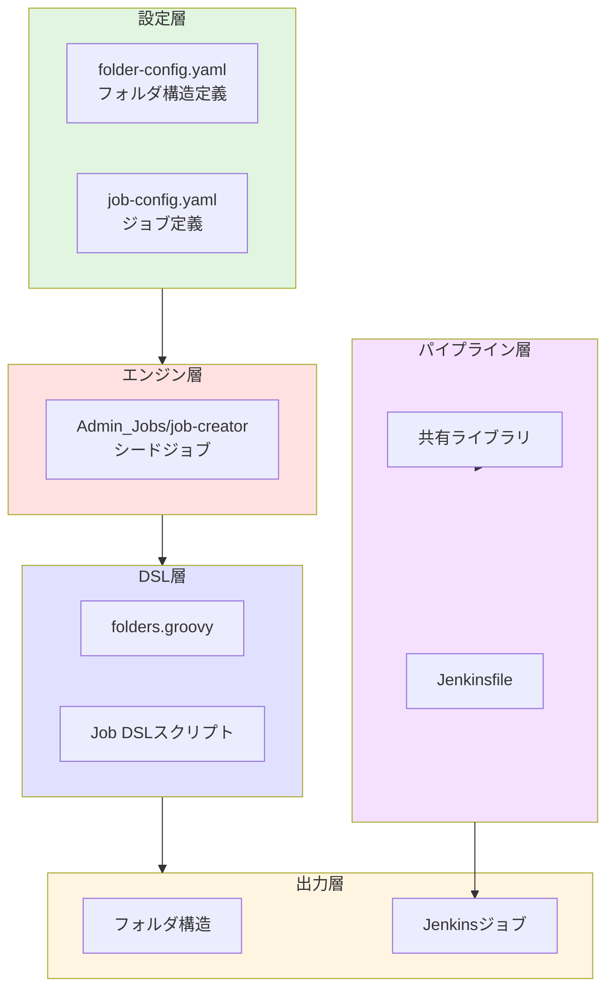
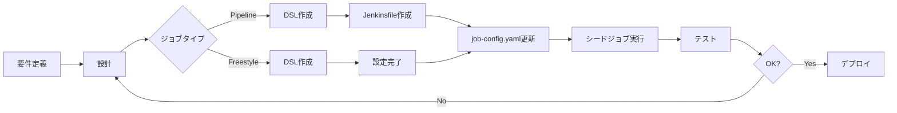

# Jenkins開発ガイド

Jenkinsジョブ、パイプライン、共有ライブラリの開発者向けガイドです。

## 📋 目次

### Part 1: 基礎編（Getting Started）
- [1.1 開発環境セットアップ](#11-開発環境セットアップ)
- [1.2 アーキテクチャ概要](#12-アーキテクチャ概要)
- [1.3 開発フロー](#13-開発フロー)

### Part 2: 実装編（Implementation）
- [2.1 ジョブ管理](#21-ジョブ管理)
  - [2.1.1 シードジョブパターン](#211-シードジョブパターン)
  - [2.1.2 Job DSL開発](#212-job-dsl開発)
  - [2.1.3 フォルダ構造管理](#213-フォルダ構造管理)
- [2.2 パイプライン開発](#22-パイプライン開発)
  - [2.2.1 パイプラインタイプの選択](#221-パイプラインタイプの選択)
  - [2.2.2 Groovy実装パターン](#222-groovy実装パターン)
  - [2.2.3 関数分離と構造化](#223-関数分離と構造化)
- [2.3 共有ライブラリ](#23-共有ライブラリ)
  - [2.3.1 ライブラリ構造](#231-ライブラリ構造)
  - [2.3.2 実装パターン](#232-実装パターン)

### Part 3: 運用編（Operations）
- [3.1 セキュリティ](#31-セキュリティ)
- [3.2 監視とログ管理](#32-監視とログ管理)
- [3.3 バックアップとリストア](#33-バックアップとリストア)
- [3.4 パフォーマンス最適化](#34-パフォーマンス最適化)

### Part 4: リファレンス（Reference）
- [4.1 コーディング規約](#41-コーディング規約)
- [4.2 よくあるパターン集](#42-よくあるパターン集)
- [4.3 トラブルシューティング](#43-トラブルシューティング)
- [4.4 テスト手法](#44-テスト手法)
  - [4.4.1 Job DSLテスト](#441-job-dslテスト)
  - [4.4.2 パイプラインテスト](#442-パイプラインテスト)
  - [4.4.3 共有ライブラリテスト](#443-共有ライブラリテスト)
  - [4.4.4 Pythonスクリプトテスト](#444-pythonスクリプトテスト)

---

## Part 1: 基礎編（Getting Started）

### 1.1 開発環境セットアップ

#### 必要なツール

| ツール | バージョン | 用途 | 必須 |
|--------|------------|------|------|
| Jenkins | 2.426.1以上 | 本体 | ✓ |
| Groovy | 3.0以上 | スクリプト言語 | ✓ |
| Docker | 20.10以上 | テスト環境 | ✓ |
| Git | 2.30以上 | バージョン管理 | ✓ |
| IntelliJ IDEA | Community以上 | IDE | 推奨 |

#### ローカル開発環境の構築

```bash
# 1. Jenkinsコンテナの起動
docker run -d \
  -p 8080:8080 \
  -p 50000:50000 \
  -v jenkins_home:/var/jenkins_home \
  -v /var/run/docker.sock:/var/run/docker.sock \
  --name jenkins-dev \
  jenkins/jenkins:lts

# 2. 初期パスワードの取得
docker exec jenkins-dev cat /var/jenkins_home/secrets/initialAdminPassword

# 3. Jenkins Test Harness（テスト用）
git clone https://github.com/jenkinsci/jenkins-test-harness.git
cd jenkins-test-harness
mvn clean install
```

#### IDE設定（IntelliJ IDEA）

```xml
<!-- .idea/libraries/Jenkins_Pipeline.xml -->
<component name="libraryTable">
  <library name="Jenkins Pipeline">
    <CLASSES>
      <root url="jar://$PROJECT_DIR$/libs/workflow-cps.jar!/" />
      <root url="jar://$PROJECT_DIR$/libs/workflow-api.jar!/" />
      <root url="jar://$PROJECT_DIR$/libs/job-dsl-core.jar!/" />
    </CLASSES>
  </library>
</component>
```

### 1.2 アーキテクチャ概要

#### システム構成



#### ディレクトリ構造

```
jenkins/
├── jobs/
│   ├── dsl/                    # Job DSLスクリプト
│   │   ├── folders.groovy      # フォルダ生成用
│   │   └── {category}/         # カテゴリ別DSL
│   ├── pipeline/               # Jenkinsfile
│   │   ├── _seed/             # シードジョブ
│   │   └── {category}/        # カテゴリ別パイプライン
│   └── shared/                # 共有ライブラリ
│       ├── src/               # Groovyクラス
│       ├── vars/              # グローバル変数
│       └── resources/         # リソースファイル
├── config/                    # Jenkins設定
│   ├── jcasc.yaml            # Configuration as Code
│   └── plugins.txt           # プラグインリスト
└── scripts/                   # ユーティリティスクリプト
```

### 1.3 開発フロー

#### 標準的な開発フロー



---

## Part 2: 実装編（Implementation）

### 2.1 ジョブ管理

#### 2.1.1 シードジョブパターン

##### 概要

シードジョブは、設定ファイルを読み込んで全ジョブを自動生成する中心的な仕組みです。

本プロジェクトでは、目的別に複数のシードジョブを運用しています：

| シードジョブ | 対象 | 実行頻度 | 説明 |
|------------|------|----------|------|
| **job-creator** | 全般ジョブ | 手動・定期 | 通常のJenkinsジョブを生成（AI Workflowジョブは除外） |
| **ai-workflow-job-creator** | AI Workflowジョブ | 手動 | AI Workflow専用のジョブ（50ジョブ）を生成 |

##### シードジョブの分離理由

AI Workflow専用シードジョブ(`ai-workflow-job-creator`)を分離し、専用設定ファイルで管理することで、以下のメリットが得られます：

- **実行時間の短縮**: AI Workflowジョブのみを更新する際、全ジョブを処理しなくて良い
- **独立した管理**: AI Workflowジョブの変更が他のジョブに影響しない
- **明確な責務分離**: ドメイン別にシードジョブを管理でき、保守性が向上
- **設定ファイルの完全分離**: 専用の`job-config.yaml`と`folder-config.yaml`により、AI Workflowと一般ジョブが完全に独立

##### 実装の流れ

1. **設定ファイルの準備**
2. **DSLスクリプトの作成**
3. **シードジョブの実行**
4. **生成されたジョブの確認**

##### 新規ジョブ作成の完全ガイド

###### Step 1: job-config.yamlへの追加

```yaml
# jenkins/jobs/pipeline/_seed/job-creator/job-config.yaml

jenkins-jobs:
  # 新規ジョブ定義
  your_new_job:
    name: 'Your_Job_Name'              # Jenkins上の実ジョブ名
    displayName: 'Your Job Display'    # UI表示名
    dslfile: jenkins/jobs/dsl/category/your_job.groovy
    jenkinsfile: jenkins/jobs/pipeline/category/your-job/Jenkinsfile
    # オプション設定
    folder: 'Category_Name'             # 配置フォルダ
    triggers:
      cron: 'H 2 * * *'                # 定期実行
      github: true                      # GitHub連携
```

###### Step 2: DSLスクリプトの作成

```groovy
// jenkins/jobs/dsl/category/your_job.groovy

// 設定の取得
def jobKey = 'your_new_job'
def jobConfig = jenkinsJobsConfig[jobKey]
def fullJobName = "${jobConfig.folder}/${jobConfig.name}"

pipelineJob(fullJobName) {
    displayName(jobConfig.displayName)
    description('ジョブの説明')

    // ⚠️ 重要: パラメータは必ずここで定義
    parameters {
        // AGENT_LABELパラメータ（必須、先頭に配置）
        choiceParam('AGENT_LABEL', ['ec2-fleet-small', 'ec2-fleet-medium', 'ec2-fleet-micro'],
            'Jenkins エージェントのラベル（small: 2並列/2GB, medium: 3並列/4GB, micro: 1並列/1GB）')

        stringParam('VERSION', '1.0.0', 'バージョン番号')
        choiceParam('ENVIRONMENT', ['dev', 'staging', 'prod'], '実行環境')
        booleanParam('DRY_RUN', false, 'ドライラン実行')
    }
    
    // トリガー設定
    if (jobConfig.triggers?.cron) {
        triggers {
            cron(jobConfig.triggers.cron)
        }
    }
    
    // パイプライン定義
    definition {
        cpsScm {
            scm {
                git {
                    remote {
                        url(jenkinsPipelineRepo.url)
                        credentials(jenkinsPipelineRepo.credentials)
                    }
                    branch(jenkinsPipelineRepo.branch)
                }
            }
            scriptPath(jobConfig.jenkinsfile)
        }
    }
    
    // ビルド履歴設定
    logRotator {
        daysToKeep(30)
        numToKeep(30)
    }
}
```

###### Step 3: Jenkinsfileの作成

```groovy
// jenkins/jobs/pipeline/category/your-job/Jenkinsfile

@Library('jenkins-shared-lib@main') _

pipeline {
    agent { label 'docker' }
    
    // ❌ parametersブロックは使用禁止！
    // パラメータはDSLファイルで定義済み
    
    environment {
        AWS_REGION = 'ap-northeast-1'
        // Jenkins全体の環境変数を参照可能
        // 例: env.GITHUB_APP_CREDENTIALS_ID, env.GITHUB_PAT_CREDENTIALS_ID
    }
    
    stages {
        stage('Initialize') {
            steps {
                script {
                    // DSLで定義したパラメータを使用
                    echo "Version: ${params.VERSION}"
                    echo "Environment: ${params.ENVIRONMENT}"
                    validateParameters()
                }
            }
        }
        
        stage('Process') {
            when {
                expression { !params.DRY_RUN }
            }
            steps {
                script {
                    executeMainProcess()
                }
            }
        }
    }
    
    post {
        always { cleanWs() }
        success { notifySuccess() }
        failure { notifyFailure() }
    }
}

// 関数定義
def validateParameters() {
    if (!params.VERSION) {
        error "VERSION is required"
    }
}

def executeMainProcess() {
    // メイン処理
}
```

##### ⚠️ パラメータ定義の絶対ルール

| 場所 | 許可 | 理由 |
|------|------|------|
| DSLファイル | ✅ | シードジョブ実行時に即座に反映 |
| Jenkinsfile | ❌ | 初回実行時にパラメータが認識されない |

**例外**: Playgroundsフォルダ内での実験的なジョブのみ、Jenkinsfileでのパラメータ定義を許可

##### 環境変数の利用

###### Jenkins全体の環境変数

JCaSCで定義されている環境変数を使用できます：

| 環境変数 | 用途 | 使用例 |
|---------|------|--------|
| `GITHUB_APP_CREDENTIALS_ID` | GitHub App認証 | `env.GITHUB_APP_CREDENTIALS_ID` |
| `GITHUB_PAT_CREDENTIALS_ID` | GitHub PAT認証 | `env.GITHUB_PAT_CREDENTIALS_ID` |
| `GIT_INFRASTRUCTURE_REPO_URL` | リポジトリURL | `env.GIT_INFRASTRUCTURE_REPO_URL` |
| `GIT_INFRASTRUCTURE_REPO_BRANCH` | ブランチ名 | `env.GIT_INFRASTRUCTURE_REPO_BRANCH` |

###### DSLでの環境変数取得

```groovy
// DSLファイル内で環境変数から取得
pipelineJob(jobName) {
    parameters {
        // 環境変数からデフォルト値を取得
        stringParam('CREDENTIALS_ID', 
                   System.getenv("GITHUB_APP_CREDENTIALS_ID") ?: 'github-app-credentials',
                   'GitHub認証情報ID')
    }
}
```

###### 共有ライブラリでの環境変数取得

```groovy
// 共有ライブラリクラス内
class GitHubApiClient {
    def script
    
    GitHubApiClient(def script) {
        this.script = script
        // Jenkinsの環境変数から取得
        def credentialsId = script.env.GITHUB_APP_CREDENTIALS_ID ?: 'github-app-credentials'
    }
}
```

##### AI Workflowジョブ作成ガイド

AI Workflow専用ジョブは`ai-workflow-job-creator`シードジョブで管理されます。以下の手順で新規AI Workflowジョブを追加します。

###### 前提条件

- AI Workflowジョブは命名規則として`ai_workflow_`プレフィックスが必要
- ジョブは`AI_Workflow`フォルダまたはそのサブフォルダに配置される
- 既存のAI Workflowジョブ：
  - `ai_workflow_planning` - 計画フェーズ
  - `ai_workflow_requirements` - 要件定義フェーズ
  - `ai_workflow_design` - 設計フェーズ
  - `ai_workflow_test_scenario` - テストシナリオフェーズ
  - `ai_workflow_implementation` - 実装フェーズ

###### Step 1: job-config.yamlへの追加

```yaml
# jenkins/jobs/pipeline/_seed/job-creator/job-config.yaml

jenkins-jobs:
  # 既存のAI Workflowジョブ...

  # 新規AI Workflowジョブ
  ai_workflow_your_phase:
    name: 'your-phase'
    displayName: 'Your Phase'
    dslfile: jenkins/jobs/dsl/ai-workflow/ai_workflow_your_phase.groovy
    jenkinsfile: jenkins/jobs/pipeline/ai-workflow/your-phase/Jenkinsfile
    folder: 'AI_Workflow/{repo_name}'  # 動的フォルダパス
```

**重要**: `ai_workflow_`プレフィックスを必ず付けることで、`job-creator`から除外され、`ai-workflow-job-creator`のみで処理されます。

###### Step 2: DSLスクリプトの作成

```groovy
// jenkins/jobs/dsl/ai-workflow/ai_workflow_your_phase.groovy

// 設定の取得
def jobKey = 'ai_workflow_your_phase'
def jobConfig = jenkinsJobsConfig[jobKey]

// AI Workflowリポジトリごとにジョブを生成
jenkinsManagedRepositories.each { repo ->
    def repoName = repo.name
    def fullJobName = "AI_Workflow/${repoName}/${jobConfig.name}"

    pipelineJob(fullJobName) {
        displayName(jobConfig.displayName)
        description("""
AI Workflow - ${jobConfig.displayName}

リポジトリ: ${repoName}
フェーズ: ${jobConfig.displayName}
""")

        // パラメータ定義
        parameters {
            stringParam('ISSUE_NUMBER', '', 'Issue番号（必須）')
            stringParam('TARGET_BRANCH', repo.defaultBranch ?: 'main', 'ターゲットブランch')
            booleanParam('DRY_RUN', false, 'ドライラン実行')
        }

        // 並行実行制限
        properties {
            disableConcurrentBuilds()
        }

        // パイプライン定義
        definition {
            cpsScm {
                scm {
                    git {
                        remote {
                            url(jenkinsPipelineRepo.url)
                            credentials(jenkinsPipelineRepo.credentials)
                        }
                        branch(jenkinsPipelineRepo.branch)
                    }
                }
                scriptPath(jobConfig.jenkinsfile)
            }
        }

        // ログローテーション
        logRotator {
            daysToKeep(90)
            numToKeep(30)
        }
    }
}
```

###### Step 3: Jenkinsfileの作成

```groovy
// jenkins/jobs/pipeline/ai-workflow/your-phase/Jenkinsfile

@Library('jenkins-shared-lib@main') _

pipeline {
    agent { label 'docker' }

    environment {
        PHASE_NAME = 'your-phase'
        AWS_REGION = 'ap-northeast-1'
    }

    stages {
        stage('Validate Parameters') {
            steps {
                script {
                    if (!params.ISSUE_NUMBER) {
                        error "ISSUE_NUMBER is required"
                    }
                    echo "Processing Issue #${params.ISSUE_NUMBER}"
                }
            }
        }

        stage('Execute Phase') {
            when {
                expression { !params.DRY_RUN }
            }
            steps {
                script {
                    // フェーズ固有の処理
                    echo "Executing ${PHASE_NAME} phase"
                }
            }
        }
    }

    post {
        always { cleanWs() }
    }
}
```

###### Step 4: シードジョブの実行

```bash
# AI Workflowジョブを生成
# Jenkins UI > Admin_Jobs > ai-workflow-job-creator > Build Now
```

**注意事項**:
- 通常の`job-creator`では、`ai_workflow_`プレフィックスのジョブは自動的に除外されます
- AI Workflowジョブの更新時は`ai-workflow-job-creator`のみを実行すればよい
- フォルダ構造（`AI_Workflow`とそのサブフォルダ）は両シードジョブで共有される

#### 2.1.2 Job DSL開発

##### ジョブタイプの選択基準

| タイプ | 使用場面 | メリット | デメリット |
|--------|----------|---------|------------|
| **Pipeline** | 複雑な処理<br>条件分岐<br>並列実行 | 柔軟性が高い<br>コード管理 | 設定が複雑 |
| **Freestyle** | 単純なトリガー<br>非同期実行 | シンプル<br>高速 | 柔軟性が低い |
| **Multibranch** | ブランチ別ビルド | 自動検出<br>並列開発 | 設定の制約 |

##### Pipelineジョブの実装

```groovy
pipelineJob(jobName) {
    // 基本設定
    displayName('表示名')
    description('説明')
    
    // パラメータ
    parameters {
        // 文字列
        stringParam('NAME', 'default', '説明')
        // 選択肢
        choiceParam('TYPE', ['A', 'B', 'C'], '説明')
        // ブール値
        booleanParam('FLAG', false, '説明')
        // テキスト（複数行）
        textParam('CONFIG', '', '説明')
        // パスワード（入力時のみ保持、ビルド後は非保存）
        nonStoredPasswordParam('SECRET', '説明')
        // パスワード（マスク表示、保存あり）
        password('API_KEY', '''
API キー（任意）
入力値はマスク表示され、ビルドログにも表示されません
        '''.stripIndent().trim())
    }
    
    // プロパティ
    properties {
        // ビルド履歴
        buildDiscarder {
            logRotator {
                daysToKeep(30)
                numToKeep(10)
            }
        }
        // GitHub連携
        githubProjectUrl('https://github.com/org/repo')
    }
    
    // トリガー
    triggers {
        cron('H 2 * * *')
        githubPush()
    }
}
```

##### Freestyleジョブの実装（非同期トリガー専用）

```groovy
freeStyleJob(jobName) {
    displayName('非同期トリガージョブ')
    
    // 並行実行の制御
    concurrentBuild(false)
    
    // ビルドステップ
    steps {
        shell('echo "Starting trigger..."')
    }
    
    // ポストビルドアクション（非同期）
    publishers {
        downstreamParameterized {
            trigger('Target/Job') {
                condition('ALWAYS')
                parameters {
                    predefinedProp('PARAM', 'value')
                }
                // 非同期実行（結果を待たない）
                triggerWithNoParameters(false)
            }
        }
    }
}
```

##### 動的ジョブ生成

```groovy
// 環境×アプリケーションのマトリックス生成
['dev', 'staging', 'prod'].each { env ->
    ['web', 'api', 'batch'].each { app ->
        pipelineJob("Deploy/${app}-${env}") {
            displayName("${app} ${env}環境")
            parameters {
                stringParam('VERSION', '', 'バージョン')
            }
            // 他の設定...
        }
    }
}
```

#### 2.1.3 フォルダ構造管理

##### folder-config.yamlの構造

```yaml
# jenkins/jobs/pipeline/_seed/job-creator/folder-config.yaml

# 静的フォルダ定義
folders:
  - path: "Admin_Jobs"
    displayName: "管理ジョブ"
    description: |
      システム管理用のジョブ群
      - シードジョブ
      - メンテナンスジョブ
      
  - path: "CI_CD/Build"  # 階層構造
    displayName: "ビルドジョブ"
    description: "ビルド関連"

# 動的フォルダ生成
dynamic_folders:
  - parent_path: "Testing"
    source: "jenkins-managed-repositories"
    template:
      path_suffix: "{name}"
      displayName: "Test - {name}"
      description: "{name}のテスト"
```

##### folders.groovyの実装

```groovy
// jenkins/jobs/dsl/folders.groovy

// 設定の読み込み
def folderConfig = binding.getVariable('jenkinsFoldersConfig')

// 静的フォルダの生成
folderConfig.folders.sort { a, b -> 
    a.path.count('/') - b.path.count('/')
}.each { folderDef ->
    folder(folderDef.path) {
        displayName(folderDef.displayName)
        description(folderDef.description)
    }
}

// 動的フォルダの生成
folderConfig.dynamic_folders?.each { rule ->
    // ソースに応じた動的生成ロジック
}
```

### 2.2 パイプライン開発

#### 2.2.1 パイプラインタイプの選択

##### Declarative vs Scripted

| 特徴 | Declarative | Scripted |
|------|-------------|----------|
| 構文 | 構造化・制限的 | 自由・柔軟 |
| 学習曲線 | 緩やか | 急 |
| エラーチェック | コンパイル時 | 実行時 |
| 推奨度 | ✅ 推奨 | 特殊ケースのみ |

##### Declarative Pipeline テンプレート

```groovy
pipeline {
    agent { label 'docker && linux' }
    
    options {
        timestamps()
        ansiColor('xterm')
        timeout(time: 1, unit: 'HOURS')
        disableConcurrentBuilds()
    }
    
    environment {
        // 環境変数
    }
    
    stages {
        stage('Stage Name') {
            when {
                // 実行条件
            }
            steps {
                // 処理
            }
        }
    }
    
    post {
        always { /* 必ず実行 */ }
        success { /* 成功時 */ }
        failure { /* 失敗時 */ }
    }
}
```

#### 2.2.2 Groovy実装パターン

##### 文字列処理のベストプラクティス

###### 1. 引用符の使い分け

```groovy
// シングルクォート: 変数展開なし
def literal = 'This is a literal string'

// ダブルクォート: Groovy変数を展開
def name = "Jenkins"
def interpolated = "Hello, ${name}"

// トリプルクォート: 複数行（''' or """）
def multiline = '''
    Line 1
    Line 2
'''
```

###### 2. Bashコマンドでの変数展開

```groovy
// ✅ 推奨: 環境変数経由
environment {
    MY_VAR = 'value'
}
steps {
    sh '''
        echo "Value: ${MY_VAR}"  # Bash変数展開
    '''
}

// ✅ 推奨: 文字列連結
def groovyVar = 'value'
sh '''echo "Value: ''' + groovyVar + '''"'''

// ❌ 避ける: 混在
sh """
    echo "${groovyVar}"     # Groovy展開（エスケープ問題）
    echo "\${BASH_VAR}"     # Bash展開（エスケープ必要）
"""
```

###### 3. 複数行文字列の処理

```groovy
// stripIndent(): インデント除去
sh """
    aws s3 cp \\
        --recursive \\
        s3://source/ \\
        s3://dest/
""".stripIndent()

// stripMargin(): マージン文字基準
echo """
    |=================
    |レポート
    |=================
    |結果: 成功
""".stripMargin()
```

###### 4. AWS CLIクエリのエスケープ

```groovy
// ✅ シンプルな引用符
sh '''
    aws ec2 describe-instances \
        --query 'Reservations[0].Instances[0].Tags[?Key==`Name`]' \
        --output text
'''

// ✅ 変数分離
def query = 'Reservations[0].Instances[0].Tags[?Key==`Name`]'
sh """
    aws ec2 describe-instances --query '${query}'
"""
```

#### 2.2.3 関数分離と構造化

##### 推奨パターン

```groovy
// ========================
// 関数定義セクション
// ========================

/**
 * パラメータ検証
 * @throws Exception 検証エラー
 */
def validateParameters() {
    if (!params.REQUIRED) {
        error "Required parameter missing"
    }
}

/**
 * メイン処理のオーケストレーション
 */
def executeMainProcess() {
    try {
        def status = checkStatus()
        if (status == 'ready') {
            performAction()
        }
    } catch (Exception e) {
        handleError(e)
    }
}

// ========================
// パイプライン定義
// ========================
pipeline {
    agent any
    
    stages {
        stage('Validate') {
            steps {
                script { validateParameters() }
            }
        }
        
        stage('Process') {
            steps {
                script { executeMainProcess() }
            }
        }
    }
}
```

##### 並列実行パターン

```groovy
stage('Parallel Tasks') {
    parallel {
        stage('Task A') {
            steps { /* ... */ }
        }
        stage('Task B') {
            steps { /* ... */ }
        }
        stage('Task C') {
            steps { /* ... */ }
        }
    }
}
```

### 2.3 共有ライブラリ

#### 2.3.1 ライブラリ構造

```
shared/
├── src/                          # Groovyクラス
│   └── jp/co/company/
│       ├── utils/               # ユーティリティ
│       │   ├── GitUtils.groovy
│       │   └── AwsUtils.groovy
│       ├── steps/               # カスタムステップ
│       └── models/              # データモデル
├── vars/                        # グローバル変数
│   ├── standardPipeline.groovy # パイプラインテンプレート
│   └── utilities.groovy        # ユーティリティ関数
├── resources/                   # リソースファイル
│   └── templates/
└── test/                       # テストコード
```

#### 2.3.2 実装パターン

##### クラスライブラリ

```groovy
// src/jp/co/company/utils/GitUtils.groovy
package jp.co.company.utils

class GitUtils implements Serializable {
    private def script

    GitUtils(def script) {
        this.script = script
    }

    String getCurrentBranch() {
        return script.sh(
            script: 'git rev-parse --abbrev-ref HEAD',
            returnStdout: true
        ).trim()
    }

    Boolean hasChangesIn(String path) {
        def changes = script.sh(
            script: "git diff --name-only HEAD~1 -- ${path}",
            returnStdout: true
        ).trim()
        return !changes.isEmpty()
    }
}
```

##### SSMパラメータ取得ユーティリティの実装例

```groovy
// src/jp/co/tielec/aws/SsmParameterStore.groovy
package jp.co.tielec.aws

class SsmParameterStore implements Serializable {
    private def script
    private String region
    private Map<String, String> cache = [:]
    private boolean useCache

    SsmParameterStore(def script, String region = 'ap-northeast-1', boolean useCache = true) {
        this.script = script
        this.region = region
        this.useCache = useCache
    }

    String getParameter(String parameterName, boolean withDecryption = true) {
        // キャッシュチェック
        if (useCache && cache.containsKey(parameterName)) {
            return cache[parameterName]
        }

        def decryptFlag = withDecryption ? '--with-decryption' : ''
        def result = script.sh(
            script: """
                aws ssm get-parameter \
                    --name '${parameterName}' \
                    --region ${region} \
                    ${decryptFlag} \
                    --query 'Parameter.Value' \
                    --output text
            """,
            returnStdout: true
        ).trim()

        if (useCache) {
            cache[parameterName] = result
        }

        return result
    }
}
```

##### グローバル変数

```groovy
// vars/utilities.groovy
import jp.co.company.utils.GitUtils

def checkoutWithSubmodules(Map config = [:]) {
    def defaults = [
        branch: 'main',
        credentialsId: 'github-credentials'
    ]
    def finalConfig = defaults + config
    
    checkout([
        $class: 'GitSCM',
        branches: [[name: finalConfig.branch]],
        extensions: [[$class: 'SubmoduleOption']],
        userRemoteConfigs: [[
            credentialsId: finalConfig.credentialsId,
            url: finalConfig.url
        ]]
    ])
}

// NonCPSメソッド（シリアライズ不可能な処理）
@NonCPS
def parseJson(String jsonText) {
    return new groovy.json.JsonSlurper().parseText(jsonText)
}
```

##### SSMパラメータ取得のグローバル変数

```groovy
// vars/ssmParameter.groovy
import jp.co.tielec.aws.SsmParameterStore

/**
 * 単一のSSMパラメータを取得
 * @param parameterName パラメータ名
 * @param region AWSリージョン（明示的指定必須）
 * @param withDecryption SecureStringの復号化（デフォルト: true）
 * @return パラメータ値
 */
def get(String parameterName, String region, boolean withDecryption = true) {
    def ssmStore = new SsmParameterStore(this, region, true)
    return ssmStore.getParameter(parameterName, withDecryption)
}

/**
 * パラメータを環境変数として設定してブロックを実行
 * @param parameterMapping パラメータ名と環境変数名のマッピング
 * @param region AWSリージョン（明示的指定必須）
 * @param body 実行するクロージャ
 */
def withParameters(Map parameterMapping, String region, Closure body) {
    def ssmStore = new SsmParameterStore(this, region, true)
    def parameterNames = parameterMapping.keySet().toList()
    def values = ssmStore.getParameters(parameterNames, true)

    def envVars = []
    parameterMapping.each { paramName, envName ->
        if (values.containsKey(paramName)) {
            envVars << "${envName}=${values[paramName]}"
        } else {
            error "SSMパラメータが見つかりません: ${paramName}"
        }
    }

    withEnv(envVars) {
        body()
    }
}
```

##### パイプラインテンプレート

```groovy
// vars/standardPipeline.groovy
def call(Map config) {
    pipeline {
        agent { label config.agent ?: 'docker' }
        
        stages {
            stage('Build') {
                when {
                    expression { config.build != null }
                }
                steps {
                    script { config.build.call() }
                }
            }
            
            stage('Test') {
                when {
                    expression { config.test != null }
                }
                steps {
                    script { config.test.call() }
                }
            }
        }
        
        post {
            always {
                script { config.cleanup?.call() }
            }
        }
    }
}
```

---

## Part 3: 運用編（Operations）

### 3.1 セキュリティ

#### 3.1.1 認証・認可設定

##### Script Security

```groovy
// Script Consoleでの承認
import org.jenkinsci.plugins.scriptsecurity.scripts.*

ScriptApproval sa = ScriptApproval.get()
// 保留中のスクリプトを承認
sa.pendingScripts.each { ps ->
    sa.approveScript(ps.hash)
}
```

##### クレデンシャル管理

```groovy
// ✅ 安全な方法
withCredentials([
    string(credentialsId: 'api-key', variable: 'API_KEY'),
    usernamePassword(
        credentialsId: 'db-creds',
        usernameVariable: 'DB_USER',
        passwordVariable: 'DB_PASS'
    )
]) {
    sh '''
        curl -H "Authorization: Bearer ${API_KEY}" \\
             https://api.example.com
    '''
}

// ❌ 危険な方法
def password = 'hardcoded-password'  // 絶対NG！
```

#### 3.1.2 CSRF対策

```groovy
// JCasC設定
jenkins:
  crumbIssuer:
    standard:
      excludeClientIPFromCrumb: false
```

#### 3.1.3 権限管理

```groovy
// Role-based Authorization Strategy
jenkins:
  authorizationStrategy:
    roleBased:
      roles:
        global:
          - name: "admin"
            permissions:
              - "Overall/Administer"
          - name: "developer"
            permissions:
              - "Job/Build"
              - "Job/Read"
```

### 3.2 監視とログ管理

#### 3.2.1 ログレベル設定

```groovy
// System Logの設定
import java.util.logging.Logger
import java.util.logging.Level

// 特定パッケージのログレベル変更
Logger.getLogger("hudson.model").setLevel(Level.FINE)
Logger.getLogger("jenkins.branch").setLevel(Level.FINEST)
```

#### 3.2.2 メトリクス収集

```groovy
pipeline {
    stages {
        stage('Metrics') {
            steps {
                script {
                    // ビルド時間の記録
                    def startTime = System.currentTimeMillis()
                    
                    // 処理実行
                    doSomething()
                    
                    def duration = System.currentTimeMillis() - startTime
                    echo "Duration: ${duration}ms"
                    
                    // カスタムメトリクス送信
                    sendMetrics([
                        'build.duration': duration,
                        'build.status': currentBuild.result
                    ])
                }
            }
        }
    }
}
```

#### 3.2.3 監査ログ

```groovy
// 重要な操作をログに記録
def auditLog(String action, Map details) {
    def timestamp = new Date().format('yyyy-MM-dd HH:mm:ss')
    def user = env.BUILD_USER ?: 'system'
    
    echo """
    [AUDIT] ${timestamp}
    User: ${user}
    Action: ${action}
    Details: ${details}
    """
    
    // 外部システムへの送信も可能
    writeFile file: "audit/${env.BUILD_NUMBER}.log", 
              text: "${timestamp},${user},${action},${details}"
}
```

### 3.3 バックアップとリストア

#### 3.3.1 ジョブ定義のバックアップ

```groovy
// バックアップスクリプト
pipeline {
    agent any
    
    stages {
        stage('Backup Jobs') {
            steps {
                script {
                    def backupDir = "/backup/jenkins/${new Date().format('yyyyMMdd')}"
                    
                    // ジョブ設定のエクスポート
                    sh """
                        mkdir -p ${backupDir}
                        
                        # ジョブ設定をXMLで保存
                        for job in \$(jenkins-cli list-jobs); do
                            jenkins-cli get-job "\$job" > "${backupDir}/\${job}.xml"
                        done
                        
                        # 圧縮
                        tar -czf ${backupDir}.tar.gz ${backupDir}
                    """
                }
            }
        }
    }
}
```

#### 3.3.2 設定のエクスポート/インポート

```groovy
// JCasCによる設定管理
jenkins:
  systemMessage: "Jenkins Managed by Code"
  numExecutors: 5
  
  # 設定のエクスポート
  # Jenkins UI > Manage Jenkins > Configuration as Code > View Configuration

// 設定の適用
def applyConfiguration() {
    sh '''
        curl -X POST \\
            -H "Content-Type: application/yaml" \\
            --data-binary @jcasc.yaml \\
            http://localhost:8080/configuration-as-code/apply
    '''
}
```

#### 3.3.3 災害復旧計画

```yaml
# disaster-recovery.yaml
recovery_plan:
  backup_frequency: "daily"
  retention: "30 days"
  
  components:
    - name: "Job Configurations"
      path: "/var/jenkins_home/jobs"
      critical: true
      
    - name: "Shared Libraries"
      path: "/var/jenkins_home/workflow-libs"
      critical: true
      
    - name: "Credentials"
      path: "/var/jenkins_home/credentials.xml"
      critical: true
      encrypted: true
```

### 3.4 パフォーマンス最適化

#### 3.4.1 ビルドキューの最適化

```groovy
// 並列度の制御
options {
    throttle(['deployment-category'])
    lock(resource: 'shared-resource')
}
```

#### 3.4.2 キャッシュ戦略

```groovy
stage('Build with Cache') {
    steps {
        cache(maxCacheSize: 500, caches: [
            arbitraryFileCache(
                path: 'node_modules',
                includes: '**/*',
                fingerprinting: true
            ),
            arbitraryFileCache(
                path: '.gradle',
                includes: '**/*',
                fingerprinting: false
            )
        ]) {
            sh 'npm install'
            sh './gradlew build'
        }
    }
}
```

#### 3.4.3 エージェントの効率化

```groovy
// Dockerエージェントの再利用
pipeline {
    agent {
        docker {
            image 'maven:3.8-jdk-11'
            args '-v /tmp/cache:/cache'
            reuseNode true  // ノードを再利用
        }
    }
}
```

---

## Part 4: リファレンス（Reference）

### 4.1 コーディング規約

#### 4.1.1 命名規則

| 要素 | 規則 | 例 |
|------|------|-----|
| ジョブ名 | PascalCase | `BuildApplication` |
| フォルダ名（ID） | PascalCase_Underscore | `Admin_Jobs` |
| フォルダ表示名 | 番号. [カテゴリ] 説明 | `01. [Admin] 管理ジョブ` |
| パラメータ | UPPER_SNAKE | `BUILD_VERSION` |
| 関数名 | camelCase | `validateInput()` |
| クラス名 | PascalCase | `GitUtils` |

##### フォルダディスプレイネーム体系

トップレベルフォルダには、以下のナンバリング体系を適用：

| 番号範囲 | カテゴリ | 用途 |
|----------|----------|------|
| 01-09 | [Admin] | 管理系 - Jenkins管理、ユーザー管理 |
| 10-19 | [Deploy] | デプロイ系 - アプリケーション、インフラのデプロイ |
| 20-29 | [Ops] | 運用系 - インフラ運用、メンテナンス |
| 30-39 | [Quality] | 品質系 - コード品質、ドキュメント生成 |
| 40-49 | [Test] | テスト系 - ライブラリ、パイプラインテスト |
| 90-99 | [Sandbox] | サンドボックス - 個人作業、実験環境 |

例：
- `01. [Admin] 管理ジョブ` - Jenkins管理タスク
- `10. [Deploy] デリバリー管理` - デプロイメントジョブ
- `30. [Quality] コード品質チェック` - 品質分析ジョブ

#### 4.1.2 ファイル構成

```groovy
// 1. ヘッダーコメント
/**
 * ジョブ名: BuildApplication
 * 説明: アプリケーションのビルド
 * 作成者: @username
 * 作成日: 2024-01-01
 */

// 2. インポート
import jp.co.company.utils.*

// 3. 定数定義
def CONSTANTS = [
    TIMEOUT: 60,
    RETRY: 3
]

// 4. メイン処理
pipeline {
    // ...
}

// 5. ヘルパー関数
def helperFunction() {
    // ...
}
```

#### 4.1.3 コメント規約

```groovy
// 単一行コメント: 簡潔な説明

/**
 * ブロックコメント:
 * 複雑な処理の説明
 * @param name パラメータ説明
 * @return 戻り値の説明
 */

// TODO: 後で実装予定
// FIXME: 修正が必要
// HACK: 一時的な回避策
```

### 4.2 よくあるパターン集

#### 4.2.1 条件分岐パターン

```groovy
// when条件
stage('Deploy') {
    when {
        allOf {
            branch 'main'
            expression { params.DEPLOY == true }
            not { changelog '.*\\[skip-deploy\\].*' }
        }
    }
    steps { /* ... */ }
}
```

#### 4.2.2 エラーハンドリングパターン

```groovy
// リトライ付きエラーハンドリング
retry(3) {
    timeout(time: 5, unit: 'MINUTES') {
        try {
            // 処理
        } catch (Exception e) {
            echo "Error: ${e.message}"
            if (currentBuild.number == 3) {
                error "Max retries reached"
            }
            sleep(time: 30, unit: 'SECONDS')
            throw e
        }
    }
}
```

#### 4.2.3 通知パターン

```groovy
def notifyBuildStatus() {
    def status = currentBuild.result ?: 'SUCCESS'
    def color = status == 'SUCCESS' ? 'good' : 'danger'
    
    slackSend(
        channel: '#ci-cd',
        color: color,
        message: """
            Job: ${env.JOB_NAME}
            Build: #${env.BUILD_NUMBER}
            Status: ${status}
            Duration: ${currentBuild.durationString}
        """.stripIndent()
    )
}
```

#### 4.2.4 スケジューラージョブパターン

```groovy
// Freestyleジョブで定期実行
freeStyleJob('Nightly_Cleanup') {
    triggers {
        // JST 00:00 = UTC 15:00
        cron('0 15 * * *')
    }

    steps {
        shell('''
            echo "Starting cleanup at $(date)"
            # クリーンアップ処理
        ''')
    }

    publishers {
        // 非同期で他ジョブをトリガー
        downstreamParameterized {
            trigger('Maintenance/Job') {
                condition('SUCCESS')
                parameters {
                    predefinedProp('MODE', 'scheduled')
                }
            }
        }
    }
}
```

#### 4.2.5 ドラフトPRフィルタリングパターン

**概要**: GitHub WebhookでドラフトPRを検出し、ジョブ実行を早期スキップすることで、API呼び出しコストとビルドリソースを削減できます。

**実装例**:

```groovy
// 1. Trigger Job（DSLファイル）でドラフト状態を取得
pipelineJob('PR_Comment_Builder') {
    triggers {
        genericTrigger {
            genericVariables {
                genericVariable {
                    key('PR_DRAFT')
                    value('$.pull_request.draft')
                    expressionType('JSONPath')
                    regexpFilter('')
                }
                genericVariable {
                    key('PR_NUMBER')
                    value('$.pull_request.number')
                    expressionType('JSONPath')
                }
            }
        }
    }

    // 下流ジョブに渡す
    parameters {
        stringParam('PR_DRAFT', '', 'ドラフト状態（true/false）')
        stringParam('PR_NUMBER', '', 'PR番号')
    }
}

// 2. Pipeline Job（Jenkinsfile）で早期スキップ
pipeline {
    agent any

    stages {
        stage('ドラフトPRチェック') {
            steps {
                script {
                    // フォールバック付き変数取得
                    def isDraft = params.PR_DRAFT ?: env.PR_DRAFT ?: 'false'

                    if (isDraft == 'true') {
                        echo "このPR (#${params.PR_NUMBER}) はドラフト状態です。処理をスキップします。"
                        echo "理由: ドラフトPRではOpenAI API呼び出しやコメント投稿が不要です。"
                        currentBuild.result = 'NOT_BUILT'
                        currentBuild.description = "ドラフトPRのためスキップ"
                        return  // パイプライン終了
                    }

                    echo "このPR (#${params.PR_NUMBER}) は非ドラフト状態です。処理を続行します。"
                }
            }
        }

        stage('PR分析') {
            steps {
                // OpenAI API呼び出しなど
            }
        }
    }
}
```

**ポイント**:
- **Generic Webhook Triggerで`$.pull_request.draft`を取得**
- **Jenkinsfileの最初のステージでドラフト判定**
- **`return`で早期終了（`error()`ではなく）**
- **`currentBuild.result = 'NOT_BUILT'`で実行されなかったことを明示**
- **フォールバック: `params.PR_DRAFT ?: env.PR_DRAFT ?: 'false'`でパラメータ欠落時も安全**

**効果**:
- ドラフトPR時のAPI呼び出しコスト削減
- ビルドリソースの効率的利用
- ビルド履歴でスキップ理由が明確

### 4.3 トラブルシューティング

#### 4.3.1 デバッグ手法

##### 環境情報の出力

```groovy
stage('Debug Info') {
    steps {
        sh 'printenv | sort'
        script {
            echo "Workspace: ${env.WORKSPACE}"
            echo "Node: ${env.NODE_NAME}"
            echo "Executor: ${env.EXECUTOR_NUMBER}"
            
            // Jenkins情報
            echo "Jenkins URL: ${env.JENKINS_URL}"
            echo "Jenkins Version: ${jenkins.model.Jenkins.VERSION}"
        }
    }
}
```

##### Script Consoleでのデバッグ

```groovy
// Jenkins > Manage > Script Console

// プラグイン一覧
Jenkins.instance.pluginManager.plugins.each {
    println "${it.shortName}:${it.version}"
}

// ジョブ一覧
Jenkins.instance.items.each { job ->
    println "${job.name}: ${job.class.simpleName}"
}

// ノード情報
Jenkins.instance.nodes.each { node ->
    println "${node.name}: ${node.toComputer().isOnline()}"
}
```

#### 4.3.2 よくあるエラーと解決策

| エラー | 原因 | 解決策 |
|--------|------|--------|
| `NotSerializableException` | クロージャ内で非シリアライズ可能オブジェクト使用 | `@NonCPS`アノテーション追加 |
| `No such DSL method` | DSLメソッドが見つからない | プラグインのインストール確認 |
| `Script not permitted` | Script Securityによるブロック | Script Approvalで承認 |
| `Cannot find credentials` | クレデンシャルID不一致 | IDの確認、スコープ確認 |
| `Timeout has been exceeded` | 処理がタイムアウト | タイムアウト値増加、処理最適化 |

#### 4.3.3 パフォーマンス問題の診断

```groovy
// ステージごとの実行時間測定
def stageTimes = [:]

stage('Build') {
    script {
        def start = System.currentTimeMillis()
        // ビルド処理
        stageTimes['Build'] = System.currentTimeMillis() - start
    }
}

post {
    always {
        script {
            echo "Stage execution times:"
            stageTimes.each { stage, time ->
                echo "  ${stage}: ${time}ms"
            }
        }
    }
}
```

### 4.4 テスト手法

#### 4.4.1 Job DSLテスト

```groovy
// test/jobdsl/JobDslTest.groovy
import javaposse.jobdsl.dsl.*
import spock.lang.Specification

class JobDslTest extends Specification {
    def "test job creation"() {
        given:
        def jobManagement = new MemoryJobManagement()
        def jobDslExecutor = new DslScriptLoader(jobManagement)
        
        when:
        jobDslExecutor.runScript("""
            pipelineJob('test-job') {
                displayName('Test Job')
            }
        """)
        
        then:
        jobManagement.savedJobs.size() == 1
        jobManagement.savedJobs['test-job'] != null
    }
}
```

#### 4.4.2 パイプラインテスト

```groovy
// test/pipeline/PipelineTest.groovy
import org.jenkinsci.plugins.workflow.cps.CpsFlowDefinition
import org.jenkinsci.plugins.workflow.job.WorkflowJob
import org.junit.Rule
import org.jvnet.hudson.test.JenkinsRule
import spock.lang.Specification

class PipelineTest extends Specification {
    @Rule
    JenkinsRule jenkins = new JenkinsRule()
    
    def "test pipeline execution"() {
        given:
        def job = jenkins.createProject(WorkflowJob, 'test')
        job.definition = new CpsFlowDefinition('''
            pipeline {
                agent any
                stages {
                    stage('Test') {
                        steps {
                            echo 'Testing'
                        }
                    }
                }
            }
        ''', true)
        
        when:
        def build = jenkins.buildAndAssertSuccess(job)
        
        then:
        jenkins.assertLogContains('Testing', build)
    }
}
```

#### 4.4.3 共有ライブラリテスト

```groovy
// test/library/SharedLibraryTest.groovy
import com.lesfurets.jenkins.unit.BasePipelineTest
import org.junit.Before
import org.junit.Test

class SharedLibraryTest extends BasePipelineTest {
    @Before
    void setUp() {
        super.setUp()
        // ライブラリの登録
        def library = library()
            .name('jenkins-shared-library')
            .retriever(localSource('/path/to/library'))
            .targetPath('/')
            .defaultVersion('main')
            .implicit(true)
            .build()
        helper.registerSharedLibrary(library)
    }

    @Test
    void testUtilityFunction() {
        // スクリプトの実行
        runScript('test/resources/testPipeline.groovy')

        // アサーション
        assertJobStatusSuccess()
        assertCallStackContains('echo Testing')
    }
}
```

#### 4.4.4 Pythonスクリプトテスト

Jenkinsパイプライン内で使用されるPythonスクリプトのユニットテストについて説明します。

##### テストフレームワーク

| ツール | バージョン | 用途 |
|--------|------------|------|
| pytest | 7.4.3以上 | テストフレームワーク |
| pytest-cov | 4.1.0以上 | カバレッジ測定 |
| pytest-mock | 3.12.0以上 | モックオブジェクト |

##### テスト実行方法

```bash
# テスト実行（基本）
pytest tests/

# カバレッジ測定付き実行
pytest --cov=. --cov-report=html --cov-report=term tests/

# 特定のマーカーのみ実行
pytest -m characterization tests/
pytest -m edge_case tests/

# 詳細出力
pytest -v tests/
```

##### テスト構造の例

```python
# tests/test_example_script.py
import pytest
from unittest.mock import Mock, patch, MagicMock

# テストクラス: 機能単位でグループ化
class TestScriptFunctionality:
    """スクリプトの主要機能のテスト"""

    @pytest.mark.characterization
    def test_basic_functionality(self):
        """
        Given: 正常な入力データ
        When: スクリプトを実行
        Then: 期待される出力が得られる
        """
        # Arrange
        input_data = {"key": "value"}

        # Act
        result = process_data(input_data)

        # Assert
        assert result is not None
        assert result["status"] == "success"

    @pytest.mark.edge_case
    def test_empty_input(self):
        """
        Given: 空の入力データ
        When: スクリプトを実行
        Then: 適切なエラーハンドリングが行われる
        """
        # Arrange
        input_data = {}

        # Act & Assert
        with pytest.raises(ValueError):
            process_data(input_data)

# フィクスチャ: テストデータの準備
@pytest.fixture
def sample_data():
    """テスト用のサンプルデータ"""
    return {
        "name": "test",
        "value": 123
    }

@pytest.fixture
def mock_external_api():
    """外部API呼び出しのモック"""
    with patch('module.external_api_call') as mock:
        mock.return_value = {"result": "success"}
        yield mock
```

##### 実装例: pulumi-stack-actionのdot_processor.py

`jenkins/jobs/pipeline/infrastructure/pulumi-stack-action/`ディレクトリに実装例があります：

```
pulumi-stack-action/
├── src/                      # 実装コード
│   ├── dot_processor.py     # DotFileProcessor（DOT処理）
│   └── urn_processor.py     # UrnProcessor（URN処理） ※Phase 2-1で追加
├── tests/                    # テストディレクトリ
│   ├── __init__.py
│   ├── conftest.py          # pytest設定・共通フィクスチャ
│   ├── test_dot_processor.py      # 統合テスト
│   ├── test_urn_processor.py      # ユニットテスト ※Phase 2-1で追加
│   └── fixtures/            # テストデータ
│       └── test_data/
│           ├── sample_urns.json
│           ├── sample_resources.json
│           └── sample_dot_strings.json
├── pytest.ini               # pytest設定ファイル
├── .coveragerc             # カバレッジ設定
├── tests/README.md         # テスト実行ガイド
└── CHARACTERIZATION_TEST.md # 動作仕様ドキュメント
```

**Phase 2-1リファクタリング（Issue #461）による変更**:
- **単一責務の原則（SRP）を適用**: URN処理を`UrnProcessor`クラスに分離
- **テスト構造の拡張**: ユニットテスト（`test_urn_processor.py`）と統合テスト（`test_dot_processor.py`）に分離
- **外部APIは維持**: `DotFileProcessor`の振る舞いは変更なし

詳細な実装例とテスト実行方法については、以下を参照してください：
- [テスト実行ガイド](../jobs/pipeline/infrastructure/pulumi-stack-action/tests/README.md)
- [動作仕様ドキュメント](../jobs/pipeline/infrastructure/pulumi-stack-action/CHARACTERIZATION_TEST.md)
- [Phase 2-1実装ログ](../.ai-workflow/issue-461/04_implementation/output/implementation.md)

---

## 付録

### クイックリファレンス

#### よく使うDSLメソッド

```groovy
// パラメータ
stringParam(name, defaultValue, description)
choiceParam(name, choices, description)
booleanParam(name, defaultValue, description)
textParam(name, defaultValue, description)

// トリガー
cron(expression)
githubPush()
upstream(threshold, jobs)

// ビルド後アクション
archiveArtifacts(artifacts)
junit(testResults)
publishHTML(target)
```

#### Pipeline構文チートシート

```groovy
// 条件
when {
    branch pattern
    environment name: pattern
    expression { }
    not { }
    allOf { }
    anyOf { }
}

// post条件
post {
    always { }
    success { }
    failure { }
    unstable { }
    changed { }
    fixed { }
    regression { }
    aborted { }
    cleanup { }
}
```

### 関連ドキュメント

- [Jenkins README](README.md) - 使用方法
- [メインCLAUDE.md](../CLAUDE.md) - プロジェクト全体のガイドライン
- [Jenkins公式ドキュメント](https://www.jenkins.io/doc/)
- [Job DSL API](https://jenkinsci.github.io/job-dsl-plugin/)
- [Pipeline Syntax](https://www.jenkins.io/doc/book/pipeline/syntax/)

### 変更履歴

| バージョン | 日付 | 内容 |
|------------|------|------|
| v2.0 | 2024-01-XX | MECE原則に基づく全面改訂 |
| | | - 重複内容の統合 |
| | | - 運用編（セキュリティ、監視、バックアップ）追加 |
| | | - 構造の再編成 |

---

**最終更新**: 2024年1月
**メンテナー**: @infrastructure-team