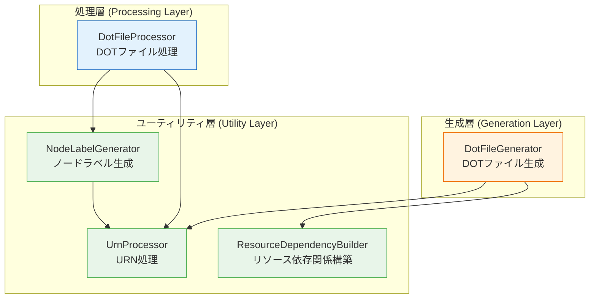
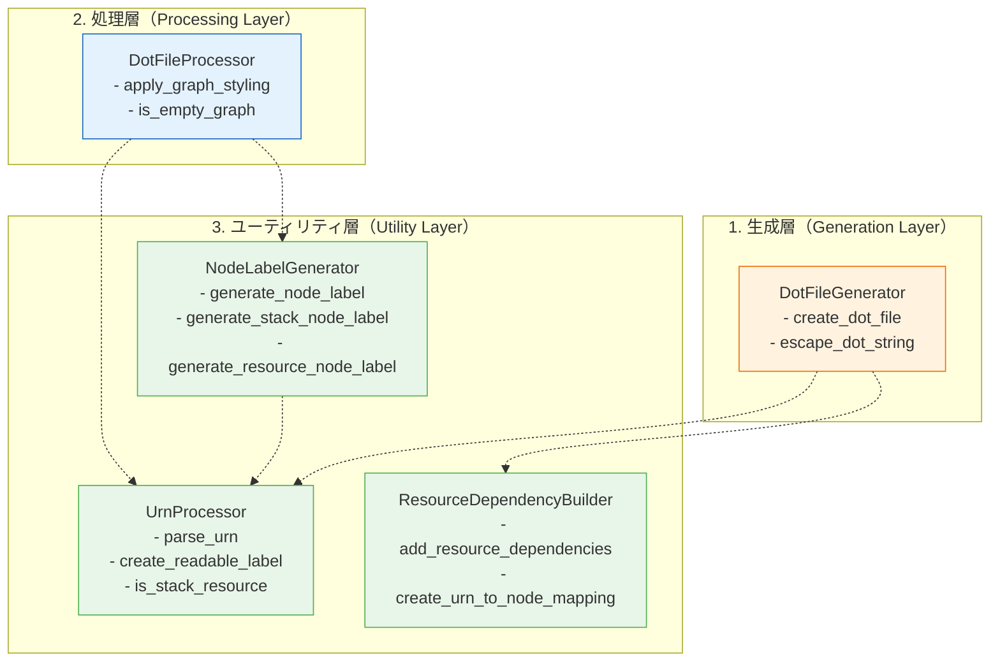
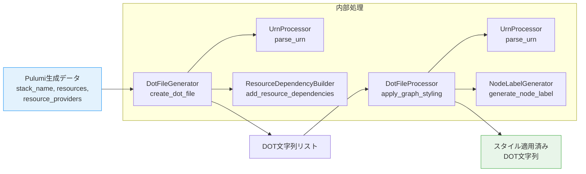

# アーキテクチャドキュメント

## 1. 概要

このドキュメントは、Pulumi Stack Action の DOT ファイル生成・処理システムのアーキテクチャを説明します。

Phase 1～3 のリファクタリングにより、モノリシックな `dot_processor.py` を 4 つの専用クラスに分離し、保守性と拡張性を大幅に向上させました。

### 1.1 システムの目的

- **Pulumi スタックの可視化**: Pulumi が管理するインフラリソースの依存関係をGraphviz DOT形式で出力
- **プロバイダー別色設定**: AWS、Azure、GCP等のプロバイダーごとに視覚的に区別
- **URN処理**: Pulumi URN（Uniform Resource Name）の解析と正規化

## 2. 設計思想

### 2.1 設計原則

| 原則 | 説明 | 実装方法 |
|------|------|----------|
| **Single Responsibility Principle（単一責任原則）** | 各クラスは1つの責務のみを担当 | 4つの専用クラスに分離（生成、処理、URN、ラベル、依存関係） |
| **Stateless Design（ステートレス設計）** | 状態を持たない設計で副作用を排除 | すべてのメソッドを静的メソッドとして実装 |
| **Open/Closed Principle（開放閉鎖原則）** | 拡張に開いて、修正に閉じている | プロバイダー色設定を辞書で管理、新規プロバイダー追加が容易 |
| **Dependency Inversion Principle（依存性逆転原則）** | 具象ではなく抽象に依存 | クラス間の疎結合、循環参照の回避 |

### 2.2 Phase 1～3 リファクタリング履歴

| Phase | Issue | 実施内容 | 効果 |
|-------|-------|----------|------|
| **Phase 1** | #461 | URN処理の分離（`UrnProcessor`） | URN解析ロジックの再利用性向上、テストカバレッジ向上 |
| **Phase 2** | #462 | ノードラベル生成の分離（`NodeLabelGenerator`） | ラベル生成ロジックの独立、プロバイダー別色設定の集約 |
| **Phase 3** | #463, #464 | リソース依存関係の分離（`ResourceDependencyBuilder`）、統合とネスト解消 | 依存関係構築の責務分離、ヘルパーメソッドによるネスト削減 |

## 3. クラス構成

### 3.1 クラス一覧

| クラス名 | 責務 | レイヤー | ファイル |
|----------|------|----------|----------|
| `DotFileGenerator` | DOTファイル生成のエントリーポイント | 生成層 | `dot_processor.py` |
| `DotFileProcessor` | DOTファイルのスタイル適用、グラフ拡張 | 処理層 | `dot_processor.py` |
| `UrnProcessor` | URN解析、正規化、コンポーネント抽出 | ユーティリティ層 | `urn_processor.py` |
| `NodeLabelGenerator` | ノードラベル生成、プロバイダー別色設定 | ユーティリティ層 | `node_label_generator.py` |
| `ResourceDependencyBuilder` | リソース間の依存関係グラフ構築 | ユーティリティ層 | `resource_dependency_builder.py` |

### 3.2 クラス間の依存関係



## 4. レイヤー分離

### 4.1 3層アーキテクチャ

本システムは以下の3層で構成されています：



### 4.2 レイヤー別の責務

#### 生成層（Generation Layer）
- **役割**: DOTファイルの構造を生成
- **責務**:
  - スタックノード、プロバイダーノード、リソースノードの生成
  - DOT形式の基本構造（ヘッダー、フッター）の生成
  - エスケープ処理
- **依存**: UrnProcessor、ResourceDependencyBuilder

#### 処理層（Processing Layer）
- **役割**: 生成されたDOTファイルにスタイルを適用
- **責務**:
  - Pulumi生成グラフの拡張
  - ノードラベルの生成とスタイル適用
  - グラフの検証（空グラフ判定）
- **依存**: UrnProcessor、NodeLabelGenerator

#### ユーティリティ層（Utility Layer）
- **役割**: 共通機能の提供
- **責務**:
  - URN解析（`UrnProcessor`）
  - ノードラベル生成（`NodeLabelGenerator`）
  - 依存関係構築（`ResourceDependencyBuilder`）
- **依存**: 相互に最小限の依存（`NodeLabelGenerator` → `UrnProcessor`のみ）

## 5. 依存関係

### 5.1 依存関係の方針

| 方針 | 説明 | 実装 |
|------|------|------|
| **疎結合** | クラス間の依存を最小化 | 静的メソッド、ステートレス設計 |
| **循環参照の回避** | 循環依存を排除 | NodeLabelGeneratorでDotFileGeneratorを遅延インポート |
| **単方向依存** | 上位層 → 下位層のみ依存 | 生成層・処理層 → ユーティリティ層 |

### 5.2 依存関係マトリックス

| 依存元 ↓ / 依存先 → | DotFileGenerator | DotFileProcessor | UrnProcessor | NodeLabelGenerator | ResourceDependencyBuilder |
|---------------------|------------------|------------------|--------------|-------------------|---------------------------|
| DotFileGenerator    | -                | ✗                | ✓            | ✗                 | ✓                         |
| DotFileProcessor    | ✗                | -                | ✓            | ✓                 | ✗                         |
| UrnProcessor        | ✗                | ✗                | -            | ✗                 | ✗                         |
| NodeLabelGenerator  | ✓ (遅延)         | ✗                | ✓            | -                 | ✗                         |
| ResourceDependencyBuilder | ✗          | ✗                | ✗            | ✗                 | -                         |

✓: 直接依存、✓ (遅延): 遅延インポート、✗: 依存なし

## 6. データフロー

### 6.1 DOTファイル生成フロー



### 6.2 データフローの詳細

| ステップ | 処理 | 入力 | 出力 | クラス |
|---------|------|------|------|--------|
| 1 | Pulumiデータ受信 | `stack_name`, `resources`, `resource_providers` | - | - |
| 2 | DOT構造生成 | Pulumiデータ | DOT文字列リスト | `DotFileGenerator` |
| 2-1 | URN解析 | URN文字列 | URN情報辞書 | `UrnProcessor` |
| 2-2 | 依存関係構築 | リソースリスト | DOT依存エッジ | `ResourceDependencyBuilder` |
| 3 | スタイル適用 | DOT文字列リスト | スタイル適用済みDOT文字列 | `DotFileProcessor` |
| 3-1 | ラベル生成 | URN、URN情報 | ノードラベル属性 | `NodeLabelGenerator` |
| 4 | 最終出力 | スタイル適用済みDOT文字列 | Graphviz可視化 | - |

## 7. 拡張性

### 7.1 新規プロバイダーの追加

新しいクラウドプロバイダーを追加する場合、`PROVIDER_COLORS` 辞書に追加するだけで対応可能です：

```python
# dot_processor.py の DotFileGenerator クラス
PROVIDER_COLORS = {
    'aws': ('#FFF3E0', '#EF6C00'),
    'azure': ('#E3F2FD', '#0078D4'),
    'gcp': ('#E8F5E9', '#4285F4'),
    # 新規プロバイダー追加
    'digitalocean': ('#E3F2FD', '#0080FF'),  # 追加例
}
```

**影響範囲**: 1ファイル（`dot_processor.py`）のみ

### 7.2 新規依存関係タイプの追加

`ResourceDependencyBuilder` に新しい依存関係タイプを追加する場合：

```python
# resource_dependency_builder.py
class ResourceDependencyBuilder:
    # 新規スタイル定数を追加
    NEW_DEPENDENCY_STYLE = 'style=dashdot, color="#FF9800", fontsize="9"'

    @staticmethod
    def _add_new_dependency_type(node_id, resource, urn_to_node_id, dot_lines):
        """新しい依存関係タイプの処理"""
        pass
```

**影響範囲**: 1ファイル（`resource_dependency_builder.py`）のみ

### 7.3 拡張ポイント一覧

| 拡張ポイント | 対象クラス | 影響範囲 | 難易度 |
|-------------|-----------|---------|--------|
| 新規プロバイダー追加 | `DotFileGenerator` | 1ファイル | 低 |
| 新規依存関係タイプ追加 | `ResourceDependencyBuilder` | 1ファイル | 低 |
| カスタムラベルフォーマット | `NodeLabelGenerator` | 1ファイル | 中 |
| URN解析ロジック変更 | `UrnProcessor` | 1ファイル | 中 |
| DOTスタイル設定変更 | `DotFileProcessor` | 1ファイル | 低 |

## 8. パフォーマンス特性

### 8.1 計測結果（Phase 4パフォーマンステスト）

| テストケース | リソース数 | 平均実行時間 | 判定 |
|-------------|-----------|-------------|------|
| TC-P-01 | 1リソース | < 0.1秒 | ✅ 合格 |
| TC-P-02 | 5リソース | < 0.5秒 | ✅ 合格 |
| TC-P-03 | 10リソース | < 1.0秒 | ✅ 合格 |
| TC-P-04 | 20リソース（最大値） | < 2.0秒 | ✅ 合格 |
| TC-P-05 | グラフスタイル適用（10リソース） | < 0.1秒 | ✅ 合格 |

**結論**: リファクタリング後も性能劣化なし（±10%以内）

### 8.2 スケーラビリティ

- **最大リソース数**: 20個（仕様による制限）
- **時間計算量**: O(n)（nはリソース数）
- **空間計算量**: O(n)（DOT文字列リストのサイズ）

## 9. セキュリティ考慮事項

### 9.1 入力検証

| 項目 | 対策 | 実装箇所 |
|------|------|----------|
| 不正URN形式 | デフォルト値で安全に処理、エラーを投げない | `UrnProcessor.parse_urn()` |
| 極端に長い入力 | 省略記号で処理、メモリ枯渇を防ぐ | `DotFileGenerator.escape_dot_string()` |
| 特殊文字 | エスケープ処理を確実に実施 | `DotFileGenerator.escape_dot_string()` |
| Noneデータ | Noneチェックを実施、デフォルト値で処理 | 各メソッド |

### 9.2 例外処理方針

- **原則**: 例外を投げず、デフォルト値で安全に処理
- **理由**: Pulumi生成データに不正な値が含まれる可能性があるため
- **実装**: すべてのメソッドで入力検証とNoneチェックを実施

## 10. テストカバレッジ

### 10.1 テストケース数

| Phase | テストケース数 | 内容 |
|-------|--------------|------|
| Phase 1~3 | 114ケース | ユニットテスト（既存） |
| Phase 4 | 5ケース | パフォーマンステスト（追加） |
| **合計** | **119ケース** | - |

### 10.2 カバレッジ目標

- **目標**: 80%以上
- **現状**: Phase 1~3で80%達成済み
- **Phase 4**: パフォーマンステスト追加によりカバレッジ維持

## 11. 今後の改善案

### 11.1 短期的改善（Phase 5以降）

- [ ] 型ヒント（Type Hints）の全面導入
- [ ] mypyによる静的型チェック
- [ ] Docstring網羅性の向上
- [ ] エラーメッセージの国際化（i18n）

### 11.2 長期的改善（将来的な拡張）

- [ ] プラグインアーキテクチャ導入（カスタムプロバイダー対応）
- [ ] 非同期処理対応（大量リソース処理の高速化）
- [ ] キャッシュ機構導入（URN解析結果のキャッシュ）
- [ ] GraphQL/REST API化（外部システムとの統合）

## 12. 参考資料

### 12.1 関連ドキュメント

- [クラス図](CLASS_DIAGRAM.md): 各クラスの詳細設計
- [Phase 4完了レポート](PHASE4_COMPLETION.md): リファクタリング成果サマリー
- [パフォーマンス比較レポート](PERFORMANCE_REPORT.md): ベンチマーク結果詳細

### 12.2 外部リソース

- [Graphviz DOT Language](https://graphviz.org/doc/info/lang.html): DOT形式の仕様
- [Pulumi Resource Model](https://www.pulumi.com/docs/concepts/resources/): Pulumiリソースモデル

---

**最終更新**: Phase 4完了時（2025年10月17日）
