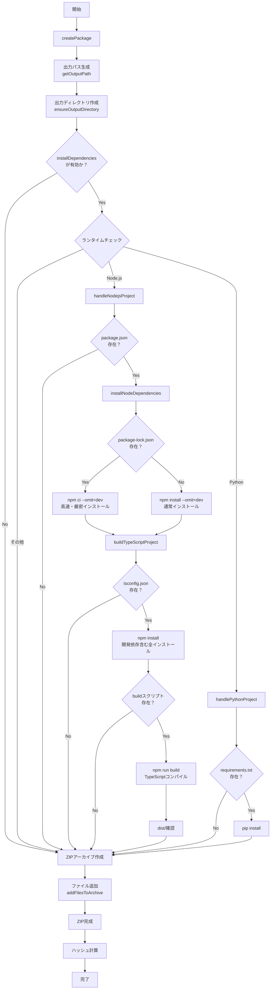

# LambdaPackagerコンポーネント詳細解説

## 概要
`LambdaPackager`は、AWS Lambda関数のソースコードを本番環境用のZIPパッケージに変換するPulumiコンポーネントです。Node.js/TypeScriptとPythonの両方をサポートし、依存関係の解決、ビルド、パッケージングを自動化します。

## 処理フローの全体像



## 各条件分岐の詳細説明

### 1. installDependencies フラグ (156-158行目)
```typescript
if (!installDependencies) {
  return;
}
```
**理由**: ユーザーが依存関係のインストールを無効にできるオプション
- **true（デフォルト）**: 本番環境用の依存関係を自動インストール
- **false**: ソースコードのみをパッケージ化（事前インストール済みの場合）

### 2. ランタイムによる処理分岐 (160-164行目)
```typescript
if (runtime.startsWith("nodejs")) {
  await this.handleNodejsProject(sourcePath, name);
} else if (runtime.startsWith("python")) {
  await this.handlePythonProject(sourcePath, name);
}
```
**理由**: 各言語で依存関係の管理方法が異なる
- **Node.js**: npm/package.jsonを使用
- **Python**: pip/requirements.txtを使用
- **その他**: 依存関係処理をスキップ

### 3. package.json存在チェック (174-177行目)
```typescript
if (!fs.existsSync(packageJsonPath)) {
  return;
}
```
**理由**: Node.jsプロジェクトでない可能性
- package.jsonがない = 単純なJavaScriptファイルのみ
- 依存関係やビルドが不要なシンプルなLambda関数

### 4. package-lock.json存在チェック (195-214行目)
```typescript
if (hasPackageLock) {
  // npm ci --omit=dev
} else {
  // npm install --omit=dev
}
```
**理由**: インストール方法の最適化
- **npm ci**: 
  - package-lock.jsonを厳密に再現
  - 高速（node_modulesを削除して再作成）
  - CI/CD環境に最適
- **npm install**:
  - package.jsonから依存関係を解決
  - 新規プロジェクトや開発中のプロジェクト用

### 5. --omit=dev オプション
**理由**: Lambda実行環境に開発依存は不要
- TypeScript、ESLint、テストツールなどを除外
- パッケージサイズを削減
- Lambda関数の起動時間を短縮

### 6. tsconfig.json存在チェック (234-237行目)
```typescript
if (!fs.existsSync(tsConfigPath)) {
  return;
}
```
**理由**: TypeScriptプロジェクトの判定
- tsconfig.jsonがある = TypeScriptプロジェクト
- ない = 純粋なJavaScriptプロジェクト（ビルド不要）

### 7. TypeScriptビルド時の完全インストール (243-247行目)
```typescript
// まず開発依存関係をインストール（TypeScriptコンパイラが必要）
await execAsync("npm install", { cwd: sourcePath });
```
**理由**: TypeScriptコンパイラは開発依存関係
- 本番用インストール（--omit=dev）ではTypeScriptがインストールされない
- ビルドには typescript パッケージが必要
- ビルド後は開発依存関係は不要（ZIPには含めない）

### 8. buildスクリプト存在チェック (255-259行目)
```typescript
if (!packageJson.scripts || !packageJson.scripts.build) {
  pulumi.log.warn(`No build script found in package.json`);
  return;
}
```
**理由**: ビルド設定がないプロジェクトへの対応
- TypeScriptを使っていてもビルド設定がない場合がある
- エラーではなく警告として処理を継続

### 9. dist/ディレクトリの確認 (277-283行目)
```typescript
if (fs.existsSync(distPath)) {
  const files = fs.readdirSync(distPath);
  pulumi.log.info(`Built files in dist/: ${files.join(", ")}`);
} else {
  pulumi.log.warn(`No dist directory found after build`);
}
```
**理由**: ビルド成功の確認
- TypeScriptビルドの一般的な出力先は dist/
- 存在しない場合は異なる出力先の可能性（警告のみ）

### 10. デフォルト除外パターン (393-418行目)
```typescript
return [
  "*.zip",           // 既存のZIPファイル
  ".git/**",         // Gitメタデータ
  "src/**",          // TypeScriptソース（ビルド済みのdist/を使用）
  "*.test.js",       // テストファイル
  "tsconfig.json",   // TypeScript設定
  "package-lock.json", // 開発時のみ必要
];
```
**理由**: Lambda実行に不要なファイルの除外
- パッケージサイズの削減
- セキュリティ（.envファイルなど）
- 実行パフォーマンスの向上

## エラー処理の詳細

### 1. 詳細なエラーログ (284-296行目)
```typescript
catch (e: any) {
  pulumi.log.error(`TypeScript build failed: ${e.message || e}`);
  if (e.stdout) pulumi.log.error(`Build stdout: ${e.stdout}`);
  if (e.stderr) pulumi.log.error(`Build stderr: ${e.stderr}`);
  if (e.code) pulumi.log.error(`Build exit code: ${e.code}`);
  throw new Error(`Failed to build TypeScript project: ${e.message || e}`);
}
```
**理由**: デバッグを容易にする
- stdout: ビルドの通常出力
- stderr: エラー出力（TypeScriptコンパイルエラーなど）
- code: 終了コード（0以外はエラー）

## まとめ

このコンポーネントの複雑さは、以下の多様なケースに対応するため：

1. **言語の多様性**: Node.js、TypeScript、Python
2. **プロジェクト構造の多様性**: 
   - 単純なJavaScriptファイル
   - npmパッケージを使うプロジェクト
   - TypeScriptプロジェクト
   - Pythonプロジェクト
3. **開発段階の多様性**:
   - package-lock.jsonがある成熟したプロジェクト
   - 開発中のプロジェクト
4. **最適化の必要性**:
   - 不要なファイルの除外
   - 開発依存関係の除外
   - パッケージサイズの最小化

各条件分岐は、これらの多様なケースを適切に処理し、エラーを防ぎ、最適なLambdaパッケージを生成するために必要です。